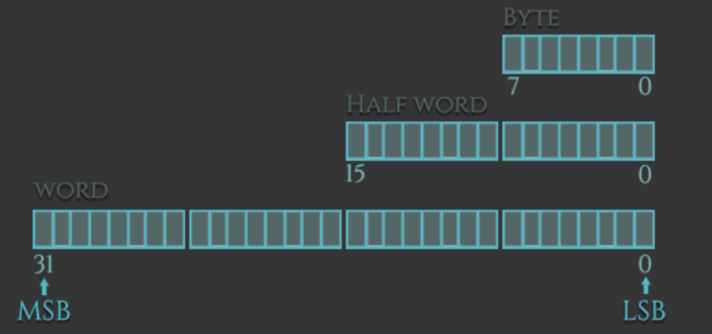
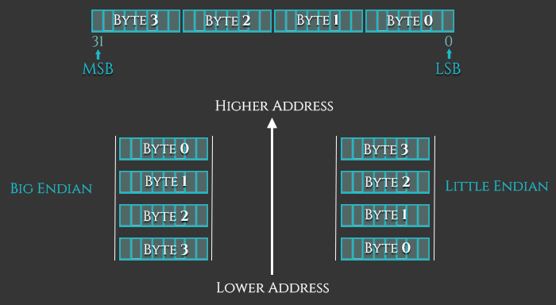
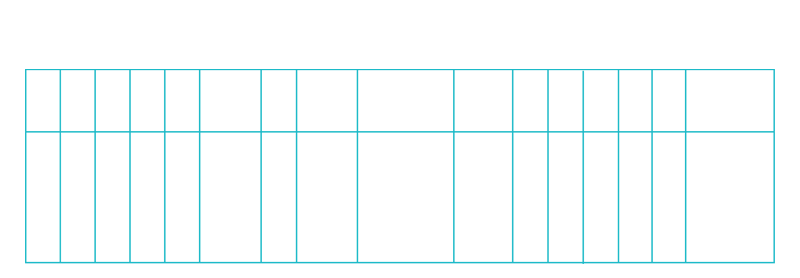

# ARM 汇编基础：数据类型和寄存器 

这是 ARM 汇编基础教程系列的第二部分，涵盖数据类型和寄存器。

类似于高级编程语言，ARM 支持对不同数据类型进行操作。我们可以加载（或存储）的数据类型可以是带符号或无符号的字（Words）、半字（Halfwords）或字节（Bytes）。这些数据类型的指令后缀为：半字使用 `-h` 或 `-sh`，字节使用 `-b` 或 `-sb`，字则没有后缀。



有符号和无符号数据类型的区别在于：
* **有符号（Signed）**数据类型可以包含正值和负值，因此其正值范围较小。
* **无符号（Unsigned）**数据类型因为多出一位，可以表示较大的正值（包括“零”），但不能包含负值，因此其表示正数的范围更广。

下面是这些数据类型如何与加载（Load）和存储（Store）指令结合使用的一些示例：

* `ldr` = 加载字 (Load Word)
* `ldrh` = 加载无符号半字 (Load unsigned Half Word)
* `ldrsh` = 加载有符号半字 (Load signed Half Word)
* `ldrb` = 加载无符号字节 (Load unsigned Byte)
* `ldrsb` = 加载有符号字节 (Load signed Bytes)
* `str` = 存储字 (Store Word)
* `strh` = 存储无符号半字 (Store unsigned Half Word)
* `strsh` = 存储有符号半字 (Store signed Half Word)
* `strb` = 存储无符号字节 (Store unsigned Byte)
* `strsb` = 存储有符号字节 (Store signed Byte)

## 字节序 (Endianness)

在内存中查看字节的基本方式有两种：**小端序（Little-Endian, LE）**和**大端序（Big-Endian, BE）**。它们的区别在于对象中每个字节在内存里存储的顺序。在像 Intel x86 这样的小端序机器上，最低有效字节（least-significant-byte）存储在最低的地址（最接近零的地址）。而在大端序机器上，最高有效字节（most-significant-byte）存储在最低的地址。

ARM 架构在第 3 版之前一直是小端序的，从那以后它变为了双端序（bi-endian），这意味着它提供了一个允许切换字节序的设置。例如，在 ARMv6 上，指令固定为小端序，而数据访问则可以是小端序或大端序，这由程序状态寄存器（CPSR）的第 9 位（即 E 位）来控制。



## ARM 寄存器 (ARM Registers)

寄存器的数量取决于 ARM 的具体版本。根据《ARM 架构参考手册》，除了基于 ARMv6-M 和 ARMv7-M 的处理器外，有 30 个通用的 32 位寄存器。前 16 个寄存器可以在用户级模式（User-level mode）下访问，其余额外的寄存器只能在特权软件执行模式（Privileged software execution）下使用（ARMv6-M 和 ARMv7-M 除外）。

在本教程系列中，我们将专注于在任何特权模式下都可访问的 16 个寄存器：`r0-15`。这 16 个寄存器可大致分为两组：**通用寄存器**和**特殊用途寄存器**。

| 寄存器 (Register) | 别名 (Alias) | 用途 (Purpose) |
| --- | --- | --- |
| **R0 - R6** | - | 通用寄存器 (General purpose) |
| **R7** | - | 保存系统调用号 (Holds Syscall Number) |
| **R8 - R10** | - | 通用寄存器 (General purpose) |
| **R11** | FP | 帧指针 (Frame Pointer) |
| **R12** | IP | 过程内调用 (Intra Procedural Call) |
| **R13** | SP | 栈指针 (Stack Pointer) |
| **R14** | LR | 链接寄存器 (Link Register) |
| **R15** | PC | 程序计数器 (Program Counter) |
| **CPSR** | - | 当前程序状态寄存器 (Current Program Status Register) |

下表可以让你大致了解 ARM 寄存器如何与 Intel 处理器（x86）中的寄存器对应起来：

| ARM | 描述 (Description) | x86 等效 |
| --- | --- | --- |
| **R0** | 通用 (General Purpose) | EAX |
| **R1-R5** | 通用 (General Purpose) | EBX, ECX, EDX, ESI, EDI |
| **R6-R10** | 通用 (General Purpose) | – |
| **R11 (FP)** | 帧指针 (Frame Pointer) | EBP |
| **R12 (IP)** | 过程内调用 (Intra Procedural Call) | – |
| **R13 (SP)** | 栈指针 (Stack Pointer) | ESP |
| **R14 (LR)** | 链接寄存器 (Link Register) | – |
| **R15 (PC)** | 程序计数器 / 指令指针 (Program Counter) | EIP |
| **CPSR** | 当前程序状态寄存器/标志 (Flags) | EFLAGS |

* **R0-R12**：在常规操作期间，可用于存储临时值、指针（指向内存位置）等。例如，在算术运算期间或用于存储先前调用函数的结果时，可以将 `R0` 视为累加器。处理系统调用时 `R7` 非常有用，因为它专门用来存储系统调用号；而 `R11` 作为帧指针（Frame Pointer）帮助我们跟踪堆栈上的边界（稍后会详细介绍）。此外，ARM 上的函数调用约定（Calling Convention）规定，函数的前四个参数需存储在寄存器 `r0-r3` 中。
* **R13 (SP - 栈指针)**：栈指针指向栈顶。栈是一块特定于函数存储的内存区域，在函数返回时将被系统回收。因此，栈指针用于在堆栈上分配空间——方法是从栈指针的值中减去我们想要分配的字节数。换句话说，如果我们想要分配一个 32 位（4 字节）的值，我们就需要从栈指针中减去 4。
* **R14 (LR - 链接寄存器)**：当进行一次函数调用时，链接寄存器将更新为一个内存地址，该地址指向启动该函数的下一条指令位置。这样做使得程序在“子”函数执行完毕后，能够准确返回到启动调用的“父”函数中。
* **R15 (PC - 程序计数器)**：程序计数器会随着指令的执行而自动递增，递增的大小就是当前执行指令的字节大小。在 ARM 状态下，一条指令始终为 4 字节；在 THUMB 模式下，指令通常为 2 字节。当执行分支指令（Branch）时，PC 将被赋予目标地址。**注意：** 在执行期间，处于 ARM 状态下的 PC 实际存储的是“当前指令地址加上 8（即超前两条 ARM 指令）”；在 Thumb(v1) 状态下，存储的是“当前指令地址加上 4（超前两条 Thumb 指令）”。这与 x86 架构不同，在 x86 中 PC 始终严格指向下一条要执行的指令。

让我们来看看 PC 在调试器中的实际表现。我们使用以下程序将 pc 的地址存储到 r0 中，并包含两条随机指令作为对照：

```asm
.section .text
.global _start

_start:
 mov r0, pc
 mov r1, #2
 add r2, r1, r1
 bkpt
```

在 GDB 中，我们在 _start 处设置断点并运行：

```bash
gef> br _start
Breakpoint 1 at 0x8054
gef> run
```
这是我们首先看到的输出结果摘要：

```bash
$r0 0x00000000   $r1 0x00000000   $r2 0x00000000   $r3 0x00000000 
...
$sp 0xbefff7e0   $lr 0x00000000   $pc 0x00008054   $cpsr 0x00000010 

0x8054 <_start>    mov r0, pc     <- $pc
0x8058 <_start+4>  mov r0, #2
0x805c <_start+8>  add r1, r0, r0
0x8060 <_start+12> bkpt 0x0000
```

可以看到，此时 PC 寄存器保存了即将执行的指令（mov r0, pc）的地址（0x8054）。现在，让我们单步执行这条指令，按理说执行完后 R0 应该保存刚才 PC 的地址（0x8054），对吧？

```bash
$r0 0x0000805c   $r1 0x00000000   $r2 0x00000000   $r3 0x00000000 
...
$sp 0xbefff7e0   $lr 0x00000000   $pc 0x00008058   $cpsr 0x00000010 

0x8058 <_start+4>  mov r0, #2     <- $pc
0x805c <_start+8>  add r1, r0, r0
0x8060 <_start+12> bkpt 0x0000
```

错了！看看 R0 中的地址。我们期望 R0 包含我们之前读取到的 PC 值（0x8054），但它实际上保存的值是 0x805c，比之前读到的 PC 值超前了整整两条指令。从这个例子可以看出，当我们直接读取 PC 的值时，在逻辑上 PC 指向的是下一条指令；但在内部流水线执行时，PC 指向的是当前正在执行的指令超前两步的位置（即 0x8054 + 8 = 0x805C）。这是因为较早期的 ARM 处理器始终会预取（Fetch）在当前正在执行（Execute）指令前面的两条指令。ARM 之所以保留这种“怪异”的定义，完全是为了兼容早期处理器的流水线特性。

## 当前程序状态寄存器 (CPSR)

当你使用 GDB 调试 ARM 二进制文件时，你总会看到一个叫做 Flags（标志位）的东西：

寄存器 `$cpsr` 显示了当前程序状态寄存器（CPSR）的值，在它的下方你可以看到 `thumb, fast, interrupt, overflow, carry, zero, negative` 这些标志。这些标志代表 CPSR 寄存器中的某些特定位，当这些条件成立（值为 1）时，调试器通常会将它们加粗显示。这里的 **N, Z, C 和 V 位**与 x86 架构 EFLAG 寄存器中的 SF, ZF, CF 和 OF 位的功能完全相同。这些位对于汇编代码中的条件执行逻辑和循环语句来说至关重要。我们将在后续部分中深入讲解它们。

CPSR 是一个 32 位的寄存器。下图寄存器最左侧保存最高有效位（MSB），最右侧保存最低有效位（LSB）。每一个位（除了系统扩展预留和模式等位组之外）都能独立定义程序当前状态的某种属性。



| 标志 (Flag) | 描述 (Description) |
| --- | --- |
| **N (Negative, 负数)** | 如果指令的结果为一个负数，则被置为 1（启用）。 |
| **Z (Zero, 零)** | 如果指令的结果计算为 0，则被置为 1。 |
| **C (Carry, 进位)** | 如果指令的结果产生进位（需要第 33 位才能完全表示），则被置为 1。 |
| **V (Overflow, 溢出)** | 如果指令的结果超出了 32 位有符号二进制补码所能表示的范围，则被置为 1。 |
| **E (Endian, 字节序)** | ARM 可以运行在小端或大端模式下。`0` 表示小端模式，`1` 表示大端模式。 |
| **T (Thumb, Thumb模式)** | 如果当前处于 Thumb 状态，该位被置 1；若在 ARM 状态，则为 0。 |
| **M (Mode, 模式位)** | 这些位共同指定 CPU 当前的特权级别模式（如 USR、SVC 等）。 |
| **J (Jazelle)** | 第三种执行状态，允许某些 ARM 处理器直接在硬件层面上执行 Java 字节码。 |

假设我们使用 `CMP` 指令来比较数字 1 和 2。执行后的结果标志将会是“负的”（Negative 被置 1），因为 1 - 2 = -1。当比较两个相等的数字时，比如 2 减 2，**Z (Zero)** 标志位就会被设置，因为 2 - 2 = 0。需要牢记的是：**与 `CMP` 比较指令一起使用的寄存器本身的值不会被修改**，只有 CPSR 会根据比较结果更新其内部的标志位。

在安装了 GEF 插件的 GDB 中，情况如下所示：假设我们比较寄存器 r1 和 r0（其中 r1 = 4 且 r0 = 2）。执行 `cmp r1, r0` 操作后，由于我们比较的是大数 4 减去小数 2 (4 - 2 = 2)，计算产生了进位且不为负数，因此 **Carry (C)** 标志位会被设置。相反，如果我们执行 `cmp r0, r1` 将较小的数字 (2) 与较大的数字 (4) 进行比较 (2 - 4 = -2)，结果为负，那么就会触发 **Negative (N)** 标志被设置。

以下是来自官方 ARM 信息中心参考文档的精确定义摘录：

APSR（应用状态寄存器，用户模式下的 CPSR）包含以下 ALU 状态标志：
* **N** – 当操作结果为负时设置。
* **Z** – 当操作结果为零时设置。
* **C** – 当操作导致进位时设置。
* **V** – 当操作导致溢出时设置。

**发生进位 (Carry) 的情况：**
* 如果加法的结果大于或等于 $2^{32}$
* 如果减法的结果为正数或为零
* 作为传送 (Move) 或逻辑指令中内联桶形移位（inline barrel shifter）操作产生的结果

**发生溢出 (Overflow) 的情况：**
* 如果加法、减法或比较的结果大于或等于 $2^{31}$，或者小于 $-2^{31}$。

---

> **注**：原文链接来自于 Azeria Labs 博客[ARM Data Types and Registers (Part 2)](https://azeria-labs.com/arm-data-types-and-registers-part-2/)，本翻译仅供学习交流使用。


