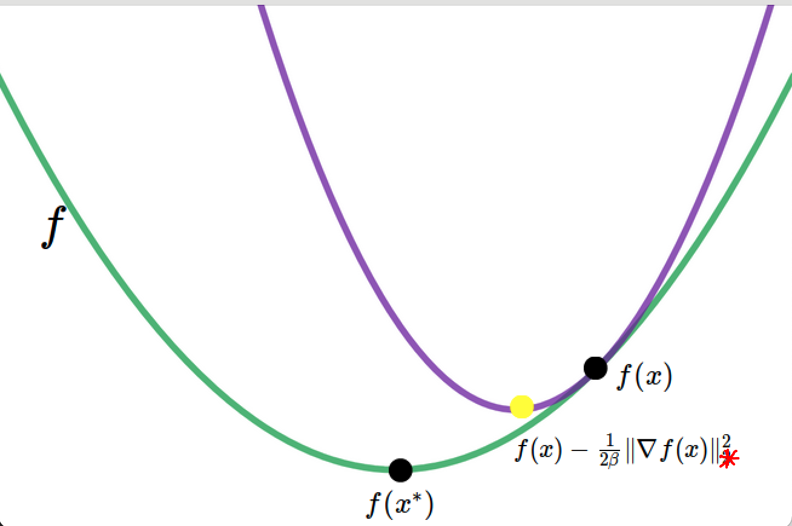
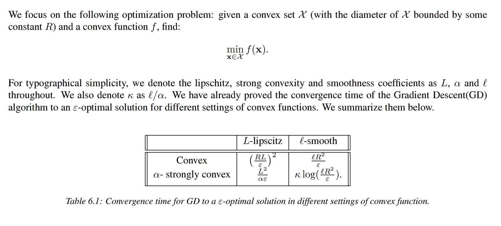
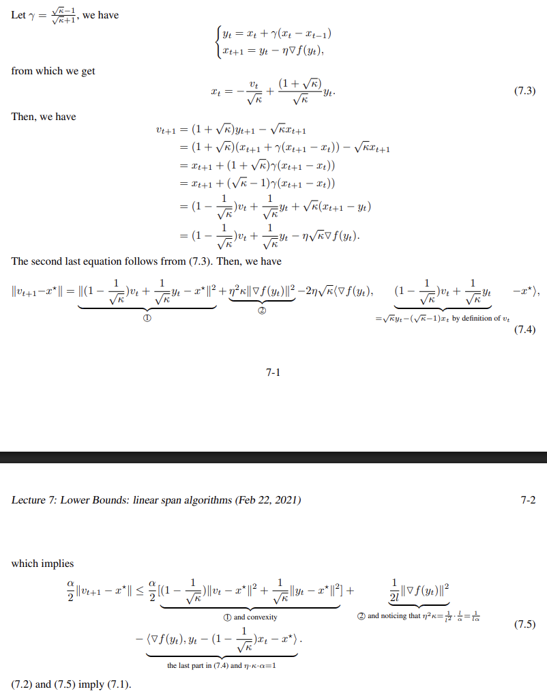

# 最优化笔记：重要性质证明

本笔记主要记录一些最优化中重要性质的证明。

---

## 1. Hyperplane Separation Theorem (超平面分离定理)

::: tip 超平面分离定理
**设 $\mathcal{X}$ 和 $\mathcal{Y}$ 是 $\mathbb{R}^d$ 中两个非空且不相交的凸子集。**

那么，存在一个非零向量 $w \in \mathbb{R}^d$，使得对于所有 $x \in \mathcal{X}$，都有 $w^T x \ge c$，且对于所有 $y \in \mathcal{Y}$，都有 $w^T y \le c$，其中 $c \in \mathbb{R}$。
:::

为了证明该定理，我们需要用到以下引理。

::: info 引理 1
设 $K$ 是 $\mathbb{R}^d$ 的非空闭凸子集。那么，存在唯一的 $v \in K$ 具有最小的欧几里得范数。
:::

*证明。* 由于 $K$ 是闭集，$\operatorname{argmin}_{v \in K} \|v\|$ 非空。利用柯西不等式，很容易看出对于任意线性无关的 $v, w \in \mathbb{R}^d$ 和 $\alpha \in (0, 1)$，我们有 $\|\alpha v + (1 - \alpha)w\| < \alpha\|v\| + (1 - \alpha)\|w\|$。现在，如果 $v_1 \neq v_2$ 都属于 $\operatorname{argmin}_{v \in K} \|v\|$，那么对于 $\alpha \in (0, 1)$，任意的 $\alpha v_1 + (1 - \alpha)v_2$ 仍然在 $K$ 中，但其范数严格更小。因此，$\operatorname{argmin}_{v \in K} \|v\|$ 是单点集（即解唯一）。 $\square$

---

**定理 1 的证明。**

考虑 $K = \mathcal{X} - \mathcal{Y}$, 显然 $K$ 是一个凸集。进一步，$\overline{K}$ 是一个凸集且闭，$0 \notin \overline{K}$。

注意到如果能证明：
$$ \exists w \neq 0, \text{ s.t. } \forall u \in \overline{K}, w^T u \ge 0 $$
那么自然地我们就可以给出原命题的证明（只需要对上确界和下确界进行分析）。

根据引理可得 $\overline{K}$ 中有范数最小的向量 $v$。取 $w = v$，下面用**反证法**证明上面的断言：

假设存在某个 $u \in \overline{K}$，使得 $v^T u < \|v\|^2$（这比 $v^T u < 0$ 的条件更弱，如果这都不成立，则原命题更不可能成立）。

由于 $\overline{K}$ 是凸集，对于任意 $\alpha \in (0, 1]$，向量 $z_{\alpha} = (1-\alpha)v + \alpha u$ 必然属于 $\overline{K}$。我们计算 $z_{\alpha}$ 的范数平方：

$$
\begin{aligned}
\|z_{\alpha}\|^2 &= \|v + \alpha(u-v)\|^2 \\
&= \|v\|^2 + 2\alpha v^T(u-v) + \alpha^2 \|u-v\|^2
\end{aligned}
$$

将假设 $v^T u < \|v\|^2$ 代入一次项系数 $v^T(u-v)$：
$$ v^T(u-v) = v^T u - \|v\|^2 < 0 $$

由于 $v^T(u-v)$ 是严格负数，当 $\alpha$ 足够小（趋近于 0）时，上述范数表达式中关于 $\alpha$ 的**一次项（负数）将主导二次项（正数）**。具体来说，只要选取足够小的 $\alpha > 0$，使得：
$$ 2\alpha (v^T u - \|v\|^2) + \alpha^2 \|u-v\|^2 < 0 $$
这就导致了：
$$ \|z_{\alpha}\|^2 < \|v\|^2 $$

这意味着我们在 $\overline{K}$ 中找到了一个比 $v$ 范数更小的向量 $z_{\alpha}$，这与引理中“$v$ 是具有最小范数的向量”这一前提**矛盾**。

因此假设不成立。对于所有 $u \in \overline{K}$，必须满足 $v^T u \ge \|v\|^2$。又因为 $0 \notin \overline{K}$，故 $\|v\|^2 > 0$，从而得证：
$$ \forall u \in \overline{K}, \quad w^T u \ge 0 $$

最后，回到集合 $\mathcal{X}$ 和 $\mathcal{Y}$。由于 $K$ 中的元素形式为 $x - y$，上述结论意味着：
$$ \forall x \in \mathcal{X}, \forall y \in \mathcal{Y}, \quad w^T (x - y) \ge 0 \implies w^T x \ge w^T y $$
取 $c \in [\sup_{y \in \mathcal{Y}} w^T y, \inf_{x \in \mathcal{X}} w^T x]$，即完成了分离定理的证明。 $\square$

---

## 2. 次梯度相关性质的证明

::: tip Proposition 1 (Existence of Subgradient)
Let $\mathcal{X} \subseteq \mathbb{R}^d$ be a convex set and $f : \mathcal{X} \to \mathbb{R}$.

1.  If $\forall x \in \mathcal{X}, \ \partial f(x) \neq \emptyset$, then $f$ is a convex function;
2.  If $f$ is convex, then $\forall x \in \operatorname{int}(\mathcal{X}), \ \partial f(x) \neq \emptyset$;
3.  If $f$ is convex and differentiable at $x$, then $\nabla f(x) \in \partial f(x)$.
:::

**证明：**

1.  我们在 $t = \gamma x + (1 - \gamma) y$ 上用次梯度的定义
    $$f(x) - f(t) \ge g_{t}^T(x - t)$$
    $$f(y) - f(t) \ge g_{t}^T(y - t)$$
    加权相加可得： 
    $$\gamma f(x) + (1 - \gamma) f(y) \ge f(t)$$

2.  我们的思路是构造一个次梯度向量。由于 $f(x)$ 是凸函数，故 $epi(f)$   是一个凸集。由支撑超平面定理，对于边界点 $(x, f(x))$，
    $$\exists (a,b) \neq 0, \forall (y, t) \in epi(f), \quad a^T y + b t \ge a^T x + b f(x)$$
    由于 $t$ 可以任意大，必有 $b \ge 0$；又因为 $x$ 是内点，超平面不能垂直（即 $b \neq 0$），故 **$b > 0$**。
    将不等式两边除以 $b$ 并移项，得：
    $$ t \ge f(x) - \frac{a^T}{b}(y - x) $$
    取 $t=f(y)$ 并令 $g = -a/b$，即得次梯度定义式：
    $$ f(y) \ge f(x) + g^T(y - x) \implies \partial f(x) \neq \emptyset $$

3.  由凸性可得：
    $$\gamma f(x) + (1 - \gamma) f(y) \ge f(\gamma x + (1 - \gamma) y)$$
    进一步整理：
    $$f(y) \ge \frac{f(\gamma x + (1 - \gamma) y) - \gamma f(x)}{1 - \gamma} = f(x) + \frac{f(\gamma x + (1 - \gamma) y) - f(x)}{1 - \gamma}$$
    令 $\gamma \to 1$,
    $$f(y) \ge f(x) + \nabla f(x)(y - x)$$

---

## 3. Ellipsoid Method (椭球法)

::: info Lemma 1
Given an ellipsoid $\mathcal{E}_0 = \{x \in \mathbb{R}^d | (x - c_0)^\top H_0^{-1} (x - c_0) \le 1\}$, where $H_0$ is some symmetric positive definite matrix. $\forall w \in \mathbb{R}^d$, there exists an ellipsoid $\mathcal{E}$ such that $\mathcal{E}_0 \cap \{(x - c_0)^\top w \le 0\} \subseteq \mathcal{E}$, which is defined as (when $d \ge 2$):

$$
\begin{align}
\mathcal{E} &= \{x \in \mathbb{R}^d | (x - c)^\top H^{-1} (x - c) \le 1\}, \tag{3.1} \\
c &= c_0 - \frac{1}{d+1} \cdot \frac{H_0 w}{\sqrt{w^\top H_0 w}}, \tag{3.2} \\
H &= \frac{d^2}{d^2 - 1} \left( H_0 - \frac{2}{d+1} \cdot \frac{H_0 w w^\top H_0}{w^\top H_0 w} \right). \tag{3.3}
\end{align}
$$

*Moreover, $\text{vol}(\mathcal{E}) < \text{vol}(\mathcal{E}_0) \cdot \exp(-\frac{1}{2d})$.*
:::

::: tip 定理 1 (Theorem 1)
假设存在 $\tilde{x}, r > 0$，使得 $B(\tilde{x}, r) \subseteq \mathcal{X} \subseteq B(0, R)$。同时假设 $\forall x \in \mathcal{X}, |f(x)| \le B$。那么对于 $T > 2d^2 \ln \frac{R}{r}$，椭球法满足 $\{c_1, \cdots, c_T\} \cap \mathcal{X} \neq \emptyset$ 并且

$$
f(x_T) - \min_{x \in \mathcal{X}} f(x) \le \frac{2BR}{r} e^{-\frac{t}{2d^2}}.
$$

换句话说，获得 $\epsilon$-最优解的迭代复杂度为 $O \left( d^2 \ln \left( \frac{BR}{r\epsilon} \right) \right)$。
:::

**定理的证明.**

假设 $\{c_1, \cdots, c_T\} \cap \mathcal{X} = \emptyset$。根据分离预言机（separation oracle）的定义，在第 $t$ 步，如果 $c_t \in \mathcal{X}$，算法才会移除 $\mathcal{X}$ 中的点。这意味着没有任何 $\mathcal{X}$ 中的点被移除；换言之 $\mathcal{X} \subseteq \mathcal{E}_T$。根据引理 1（Lemma 1），

$$
\text{vol}(\mathcal{E}_T) < \text{vol}(\mathcal{E}_0) \cdot \exp \left\{ -\frac{T}{2d} \right\} < \text{vol}(\mathcal{E}_0) \left( \frac{r}{R} \right)^d \le \text{vol}(\mathcal{X}).
$$

这与 $\mathcal{X} \subseteq \mathcal{E}_T$ 矛盾。因此我们断定 $\{c_1, \cdots, c_T\} \cap \mathcal{X} \neq \emptyset$，这证明了定理的第一部分陈述。
$\text{ }$

现在，假设 $c_t \in \mathcal{X}$。算法计算次梯度 $w_t \in \partial f(c_t)$。注意到

$$
(\mathcal{E}_t \setminus \mathcal{E}_{t+1}) \cap \mathcal{X} \subseteq S_t := \{ x : w_t^\top (x - c_t) > 0 \}.
$$

由 $f$ 的凸性，$\forall x \in S_t$，

$$
f(x) \ge f(c_t) + w_t^\top (x - c_t) > f(c_t).
$$

换句话说，当 $c_t \in \mathcal{X}$ 时，我们只移除了函数值比 $c_t$ 大的点。等价地说，$f(y) \le f(c_t)$ 意味着 $y \in \mathcal{E}_{t+1}$。

$\text{ }$

现在，定义 $\mathcal{X}_\epsilon := \{ (1 - \epsilon)x^* + \epsilon x, x \in \mathcal{X} \}$，其中 $x^* \in \text{argmin}_{x \in \mathcal{X}} f(x)$。由凸性可知，$\forall y \in \mathcal{X}_\epsilon$

$$
f(y) \le (1 - \epsilon)f(x^*) + \epsilon f(x) \le f(x^*) + 2\epsilon B.
$$

因此 $\sup_{x \in \mathcal{X}_\epsilon} f(x) \le f(x^*) + 2\epsilon B$。通过选择 $\epsilon = \frac{R}{r} e^{-\frac{T}{2d^2}}$，那么

$$
\begin{aligned}
\text{vol}(\mathcal{E}_T) &< \text{vol}(\mathcal{E}_0) \cdot \exp \left( -\frac{T}{2d} \right) \le \text{vol}(\mathcal{X}) \cdot \left( \frac{R}{r} \right)^d \exp \left( -\frac{T}{2d} \right) \\
&= \text{vol}(\mathcal{X}_\epsilon) \cdot \epsilon^{-d} \left( \frac{R}{r} \right)^d \exp \left( -\frac{T}{2d} \right) = \text{vol}(\mathcal{X}_\epsilon).
\end{aligned}
$$

这意味着我们一定在某个步骤 $t \le T$ 移除了属于 $\mathcal{X}_\epsilon$ 的点。因此，

$$
f(x_T) \le \sup_{x \in \mathcal{X}_\epsilon} f(x) \le f(x^*) + 2\epsilon B = f(x^*) + \frac{2BR}{r} e^{-\frac{T}{2d^2}}. \quad \square
$$

---

## 4. 梯度下降算法与时间复杂度

下面简单梳理一下梯度下降的一些常见算法和对于特定函数性质下的时间复杂度：

### 1. 梯度下降算法

> **for** $s = 1$ **to** $t$ **do**
> $$x_{s+1} = x_s - \eta_s \nabla f(x_s)$$

为了说明算法 1，注意到梯度下降更新等价于最小化 $f$ 在 $x_t$ 附近的线性化版本，并带有一个依赖于 $1/\eta_s$ 的距离惩罚项：

$$
x_{s+1} = \underset{x \in \mathbb{R}^d}{\arg \min} \langle \nabla f(x_s), x - x_s \rangle + \frac{1}{2\eta_s} \|x - x_s\|^2.
$$

*证明*。这个最小化问题是凸的，因此只需找到函数的临界点即可。将关于 $x$ 的梯度设为零可得

$$
\nabla f(x_s) + \frac{1}{\eta_s} (x - x_s) = 0 \implies x = x_s - \eta_s \nabla f(x_s). \quad \square
$$

### 2. 投影梯度下降算法

对于在 $\mathbb{R} ^ n$上的优化问题我们可以直接使用梯度下降算法，对于限定在特定集合 $\mathcal{X}$ 上的优化问题我们一般采用投影梯度下降
为了求解约束优化问题，我们假设可以使用一个由下式定义的投影预言机 $\Pi_{\mathcal{X}}$：

$$
\Pi_{\mathcal{X}}(y) = \underset{x \in \mathcal{X}}{\arg \min} \|x - y\|.
$$

这允许我们定义投影梯度下降：

> **for** $s = 1$ **to** $t$ **do**
> $$
> \begin{aligned}
> y_{s+1} &= x_s - \eta_s \nabla f(x_s) \\
> x_{s+1} &= \Pi_{\mathcal{X}}(y_{s+1})
> \end{aligned}
> $$

下面给出投影梯度下降的相关性质：

::: info 引理 1
设 $x \in \mathcal{X}, y \in \mathbb{R}^d$。则，

$$
(\Pi_{\mathcal{X}}(y) - x)^T (\Pi_{\mathcal{X}}(y) - y) \leq 0
$$
:::

*证明*。设 $z = \Pi_{\mathcal{X}}(y)$。设 $\lambda \in [0, 1]$ 并考虑点 $(1 - \lambda)z + \lambda x$。由凸性可知，因为 $x$ 和 $z$ 都在 $\mathcal{X}$ 中，这个凸组合也在其中。那么根据定义，我们必须有

$$
\begin{aligned}
\|y - z\|^2 &\leq \|y - (1 - \lambda)z - \lambda x\|^2 \\
&= \|y - z\|^2 + 2\lambda(y - z)^T(z - x) + \lambda^2\|z - x\|^2
\end{aligned}
$$

对 $\lambda$ 求导并在 $\lambda = 0$ 处求值，可得 $(z - x)^T(z - y) \leq 0$。 $\square$

这给出了以下简单的推论：

::: info 推论 1
设 $x \in \mathcal{X}, y \in \mathbb{R}^d$。则，

$$
\|\Pi_{\mathcal{X}}(y) - x\| \leq \|y - x\|.
$$
:::

*证明*。如上所述，设 $z = \Pi_{\mathcal{X}}(y)$。则，

$$
\begin{aligned}
\|y - x\|^2 &= \|y - z + z - x\|^2 \\
&= \|y - z\|^2 + 2\langle y - z, z - x \rangle + \|z - x\|^2 \\
&\geq \|z - x\|^2.
\end{aligned}
$$

### 3. Lipschitz 连续性

$\forall x, y \in \mathcal{X}$，都有
$$
|f(x) - f(y)| \leq L\|x - y\|.
$$
则称 $f$ 是 $L$-Lipschitz 的。这控制了 $f$ 变化的速度，并且通过以下方式与次梯度的范数相关联：

::: info 引理 2
如果对于所有 $x \in \mathcal{X}$ 和所有次梯度 $g \in \partial f(x)$，都有 $\|g\| \leq L$，那么 $f$ 是 $L$-Lipschitz 的；反之，如果 $f$ 是 $L$-Lipschitz 的，那么对于所有 $x \in \text{int}(\mathcal{X})$ 和所有 $g \in \partial f(x)$，都有 $\|g\| \leq L$。
:::

*证明*。对于第一个方向，设 $g_x$ 是点 $x$ 处的一个次梯度。那么根据 $g_y$ 的定义以及柯西-施瓦茨 (Cauchy-Schwarz) 不等式，对于所有 $x, y \in \mathcal{X}$，我们有

$$
f(y) - f(x) \leq \langle g_y, y - x \rangle \leq \|g_y\|\|x - y\| \leq L\|x - y\|
$$

通过交换 $x$ 和 $y$，我们得到 $f(x) - f(y) \leq L\|x - y\|$，因此 $|f(x) - f(y)| \leq L\|x - y\|$。

对于反方向，设 $x \in \text{int}(\mathcal{X})$。设 $v$ 为任意向量，并设 $\lambda$ 足够小使得 $x + \lambda v \in \mathcal{X}$（这是可能的，因为 $x \in \text{int}(\mathcal{X})$）。设 $g_x$ 为 $x$ 处的一个次梯度。那么，

$$
\langle g_x, \lambda v \rangle \leq f(x + \lambda v) - f(x) \leq L\lambda\|v\|.
$$

因此，对于所有 $v$ 都有 $\langle g_x, v \rangle \leq L\|v\|$，如果我们选取 $v = g_x$，则证明完成。 $\square$

---

下面我们可以给出投影梯度下降算法收敛速度的证明：

::: tip 定理 1
如果 $f$ 是 $L$-Lipschitz 的（对于所有 $x \in \mathcal{X}$ 都有 $\|g_x\|^2 \leq L$）且是凸的，那么对于固定的 $t$ 和 $\eta_s = \eta = \frac{R}{L\sqrt{t}}$，

$$
f \left( \frac{1}{t} \sum_{s=1}^t x_s \right) - f(x^*) \leq \frac{RL}{\sqrt{t}}.
$$
:::

*证明*。首先注意到

$$
\begin{aligned}
f(x_s) - f(x^*) &\leq g_s^T(x_s - x^*) \\
&= \frac{1}{\eta}(x_s - y_{s+1})^T(x_s - x^*) \\
&= \frac{1}{2\eta} [\|x_s - y_{s+1}\|^2 + \|x_s - x^*\|^2 - \|y_{s+1} - x^*\|^2] \\
&= \frac{1}{2\eta} [\|x_s - x^*\|^2 - \|y_{s+1} - x^*\|^2] + \frac{\eta}{2}\|g_s\|^2.
\end{aligned}
$$

现在根据推论 1，$\|y_{s+1} - x^*\| \geq \|x_{s+1} - x^*\|$ 并且我们有 $\|g_s\| \leq L$，所以

$$
f(x_s) - f(x^*) \leq \frac{1}{2\eta} [\|x_s - x^*\|^2 - \|x_{s+1} - x^*\|^2] + \frac{\eta L^2}{2}.
$$

现在我们可以利用裂项消元得到

$$
\begin{aligned}
\sum_{s=1}^t (f(x_s) - f(x^*)) &\leq \frac{1}{2\eta} [\|x_1 - x^*\|^2 - \|x_{t+1} - x^*\|^2] + \frac{\eta L^2 t}{2} \\
&\leq \frac{R^2}{2\eta} + \frac{\eta L^2 t}{2}.
\end{aligned}
$$

对 $\eta$ 进行优化得到 $\eta = \frac{R}{L\sqrt{t}}$，将其代入可得

$$
\sum_{s=1}^t (f(x_s) - f(x^*)) \leq RL\sqrt{t}.
$$

最后，根据凸性，我们可以除以 $t$ 并将求和移到 $f$ 内部，得到

$$
f \left( \frac{1}{t} \sum_{s=1}^t x_s \right) - f(x^*) \leq \frac{RL}{\sqrt{t}}. \quad \square
$$

::: warning 注意
1.  为了达到所需的精度 $\epsilon$，你需要 $t = R^2 L^2 / \epsilon^2 = \mathcal{O}(1 / \epsilon^2)$。相比于 ellipsoid method 得到的 $\mathcal{O}(d^2 \log 1/\epsilon)$，这是一个在 $\epsilon$ 上慢得多的速率。然而，它完全独立于 $d$。因此，在对 $1/\epsilon$ 的依赖和对 $d$ 的依赖之间存在一种权衡。
2.  投影步骤 $x_{t+1} = \Pi_{\mathcal{X}}(y_{t+1})$ 可能非常缓慢，例如当集合 $\mathcal{X}$ 是线性规划的解集时。在这种情况下，大部分时间都花在了投影步骤上，因此 oracle 框架可能不适合用于分析运行时间。
3.  常数 $\eta = \frac{R}{L\sqrt{t}}$ 的选择是为了证明的简洁性。然而，我们可以通过令 $\eta_s = \frac{R}{L\sqrt{s}}$ 为变化的步长，从而避免固定时间跨度 $t$，并且我们可以在忽略对数因子的情况下恢复相同的收敛保证。
:::

### 4. Lipschitz 连续 + strong convex

如果对于所有的 $x, y \in \mathcal{X}$ 以及所有的 $g_x \in \partial f(x)$，都有
$$f(y) \geq f(x) + g_x^T(y - x) + \frac{\alpha}{2}\|y - x\|^2，$$
则称 $f$ 是 $\alpha$-强凸（$\alpha$-strongly convex）的。

关于 $\alpha$-强凸性还有另外两个等价定义：

::: details 等价定义
1.  $f$ 是 $\alpha$-强凸的，当且仅当函数 $x \to f(x) - \frac{\alpha}{2}\|x\|^2$ 是凸的。
2.  如果 $f$ 是二阶可微的，则 $f$ 是 $\alpha$-强凸的，当且仅当对于所有的 $x \in \mathcal{X}$，其 Hessian 矩阵的最小特征值 $\lambda_{\min}(\nabla^2 f(x)) \geq \alpha$。
:::

*证明：*

1.  **证明“定义 2” $\iff$ “等价定义 1”**
    令 $\phi(x) = f(x) - \frac{\alpha}{2}\|x\|^2$。
    $\phi(x)$ 是凸函数，当且仅当对其任意次梯度 $g_\phi \in \partial \phi(x)$，满足：
    $$\phi(y) \geq \phi(x) + g_\phi^T(y - x) \tag{*}$$
    由于 $g_\phi = g_x - \alpha x$（其中 $g_x \in \partial f(x)$），代入 $(*)$ 式：
    $$f(y) - \frac{\alpha}{2}\|y\|^2 \geq f(x) - \frac{\alpha}{2}\|x\|^2 + (g_x - \alpha x)^T(y - x)$$
    整理得：
    $$f(y) \geq f(x) + g_x^T(y - x) + \frac{\alpha}{2} \left( \|y\|^2 - \|x\|^2 - 2x^T(y - x) \right)$$
    注意到括号内项恒等于 $\|y - x\|^2$：
    $$\|y\|^2 - \|x\|^2 - 2x^Ty + 2\|x\|^2 = \|y\|^2 - 2x^Ty + \|x\|^2 = \|y - x\|^2$$
    故该式等价于定义 2：$f(y) \geq f(x) + g_x^T(y - x) + \frac{\alpha}{2}\|y - x\|^2$。

2.  **证明“等价定义 1” $\iff$ “等价定义 2”**
    假设 $f$ 二阶可微，则 $\phi(x) = f(x) - \frac{\alpha}{2}\|x\|^2$ 亦二阶可微。
    $\phi(x)$ 是凸函数，当且仅当其 Hessian 矩阵半正定：
    $$\nabla^2 \phi(x) \succeq 0$$
    计算 $\phi(x)$ 的 Hessian 矩阵：
    $$\nabla^2 \phi(x) = \nabla^2 \left( f(x) - \frac{\alpha}{2} x^T x \right) = \nabla^2 f(x) - \alpha I$$
    其中 $I$ 是单位矩阵。
    $$\nabla^2 f(x) - \alpha I \succeq 0 \iff \forall v, v^T(\nabla^2 f(x))v \geq \alpha \|v\|^2$$
    根据特征值的性质，这等价于其最小特征值：
    $$\lambda_{\min}(\nabla^2 f(x)) \geq \alpha$$
    证明完毕。

---

::: tip 定理 2
如果 $f$ 是 $L$-Lipschitz 且 $\alpha$-强凸的，令 $\eta_s = \frac{2}{\alpha(s+1)}$，则有：
$$f\left(\frac{2}{t(t+1)} \sum_{s=1}^t s \cdot x_s\right) - f(x^*) \le \frac{2L^2}{\alpha(t+1)}$$
:::

**证明.** 代入 $\alpha$-强凸的定义，并遵循定理 1 证明中的相同步骤：
$$
\begin{aligned}
f(x_s) - f(x^*) &\le g_s^T(x_s - x^*) - \frac{\alpha}{2}\|x_s - x^*\|^2 \\
&\le \frac{\eta L^2}{2} + \frac{1}{2\eta} \left[\|x_s - x^*\|^2 - \|x_{s+1} - x^*\|^2\right] - \frac{\alpha}{2}\|x_s - x^*\|^2
\end{aligned}
$$

代入 $\eta_s$ 的值得到：
$$
\begin{aligned}
f(x_s) - f(x^*) &\le \frac{L^2}{\alpha(s+1)} + \frac{\alpha(s+1)}{4} \left[\|x_s - x^*\|^2 - \|x_{s+1} - x^*\|^2\right] - \frac{\alpha}{2}\|x_s - x^*\|^2 \\
&= \frac{L^2}{\alpha(s+1)} + \frac{\alpha(s-1)}{4} \|x_s - x^*\|^2 - \frac{\alpha(s+1)}{4} \|x_{s+1} - x^*\|^2
\end{aligned}
$$

于是等式两边乘以 $s$ 得到：
$$s(f(x_s) - f(x^*)) \le \frac{L^2}{\alpha} + \frac{\alpha s(s-1)}{4}\|x_s - x^*\|^2 - \frac{\alpha s(s+1)}{4}\|x_{s+1} - x^*\|^2$$

对 $s$ 从 $1$ 到 $t$ 求和并利用项消去（telescoping sum）得到：
$$\sum_{s=1}^t s(f(x_s) - f(x^*)) \le \frac{L^2 t}{\alpha} - \frac{\alpha t(t+1)}{4}\|x_{t+1} - x^*\|^2 \le \frac{L^2 t}{\alpha}$$

最后除以 $\frac{t(t+1)}{2}$ 并利用凸性（Jensen 不等式），我们得到：
$$f\left(\frac{2}{t(t+1)} \sum_{s=1}^t s \cdot x_s\right) - f(x^*) \le \frac{2L^2}{\alpha(t+1)}$$
$\square$

注意到达到误差 $\epsilon$ 所需的迭代次数为 $\frac{2L^2}{\alpha\epsilon} - 1 = \mathcal{O}(1/\epsilon)$，这仍然是与维度无关的，且在对 $\epsilon$ 的依赖性上比一般凸情况更好。

---

## 5. 光滑凸函数的时间复杂度

::: info 定义 ($\ell$-光滑)
我们称一个可微函数 $f$ 是 $\ell$-光滑的，如果对于任意 $x, y \in \mathcal{X}$，都有 $$\|\nabla f(x) - \nabla f(y)\| \le \ell \|x - y\|$$
:::

在 $f$ 二阶可微的情况下，$\ell$-光滑性等价于对于所有 $x \in \mathcal{X}$，有 $\lambda_{\max}(\nabla^2 f(x)) \le \ell$。

**1. 充分性 ($\Leftarrow$):**
已知对任意 $z$，$\|\nabla^2 f(z)\|_2 \le \ell$。由微积分基本定理：
$$
\begin{aligned}
\|\nabla f(y) - \nabla f(x)\| &= \left\| \int_{0}^{1} \nabla^2 f(x + t(y-x))(y-x) dt \right\| \\
&\le \int_{0}^{1} \|\nabla^2 f(x + t(y-x))\|_2 \cdot \|y-x\| dt \\
&\le \int_{0}^{1} \ell \cdot \|y-x\| dt = \ell \|y-x\|
\end{aligned}
$$
证毕。

**2. 必要性 ($\Rightarrow$):**
已知 $\|\nabla f(y) - \nabla f(x)\| \le \ell \|y-x\|$。
对任意单位向量 $v$（$\|v\|=1$），由泰勒展开：
$$ \nabla f(x + tv) = \nabla f(x) + t \nabla^2 f(x) v + o(t) $$
移项并取范数，除以 $t$：
$$ \left\| \frac{\nabla f(x + tv) - \nabla f(x)}{t} \right\| = \|\nabla^2 f(x) v + \frac{o(t)}{t}\| \le \ell $$
令 $t \to 0$，得 $\|\nabla^2 f(x) v\| \le \ell$。
由于这对应任意单位向量 $v$ 成立，故矩阵谱范数（最大特征值） $\lambda_{\max}(\nabla^2 f(x)) \le \ell$。
证毕。

---

**Descent Lemma:**
::: tip 引理 1
如果 $f$ 是 $\ell$-光滑的，则对于任意 $x, y \in \mathcal{X}$：
$$f(y) \le f(x) + \langle \nabla f(x), y - x \rangle + \frac{\ell}{2} \|y - x\|^2 $$
:::

*证明：*
**证明.**
$$
\begin{aligned}
& f(y) - f(x) - \langle \nabla f(x), y - x \rangle \\
= & \int_{0}^{1} \nabla f(x + t(y - x))^{\top} (y -x) dt - \langle \nabla f(x), y - x \rangle \\
= & \int_{0}^{1} [\nabla f(x + t(y - x)) - \nabla f(x)]^{\top} (y - x) dt \\
\le & \int_{0}^{1} \ell t \|y - x\|^2 dt = \frac{\ell}{2} \|y - x\|^2.
\end{aligned}$$

---

---

事实上我们可以证明一个更强的结论：

**目标**：证明 $f$ 是 $\ell$-平滑的（即 $\|\nabla f(x) - \nabla f(y)\| \le \ell \|x-y\|$），当且仅当：
$$
|f(x) - f(y) - \langle \nabla f(y), x - y \rangle| \leq \frac{\ell}{2}\|x - y\|^2
$$

**证明**：

**思路**：利用该不等式限制 Hessian 矩阵的特征值（假设 $f$ 二阶可导），进而利用中值定理推导梯度的 Lipschitz 连续性。

由已知不等式，去掉绝对值可得：
$$
-\frac{\ell}{2}\|x-y\|^2 \le f(x) - f(y) - \langle \nabla f(y), x - y \rangle \le \frac{\ell}{2}\|x-y\|^2
$$

对 $f(x)$ 在 $y$ 处进行二阶泰勒展开，$f(x) = f(y) + \langle \nabla f(y), x-y \rangle + \frac{1}{2}(x-y)^T \nabla^2 f(\xi) (x-y)$。代入上式可得：
$$
-\frac{\ell}{2}\|x-y\|^2 \le \frac{1}{2}(x-y)^T \nabla^2 f(\xi) (x-y) \le \frac{\ell}{2}\|x-y\|^2
$$

这表明 Hessian 矩阵 $\nabla^2 f(x)$ 的特征值被限制在 $[-\ell, \ell]$ 之间，即其谱范数 $\|\nabla^2 f(x)\| \le \ell$。
根据向量值函数的中值定理：
$$
\|\nabla f(x) - \nabla f(y)\| \le \left( \sup_{z \in [x,y]} \|\nabla^2 f(z)\| \right) \|x - y\| \le \ell \|x - y\|
$$

---

我们之前指出过梯度下降算法实质上是每次迭代中计算$$x_{t+1} = \operatorname{argmin}_{x \in \mathbb{R}^d} f(x_t) + \langle \nabla f(x_t), x - x_t \rangle + \frac{1}{2\eta} \|x - x_t\|^2$$

由 Lemma 1 可得，当 $\eta l \le 1$，$$\forall x \in \mathcal{X}, f(x) \le f(x_t) + \langle \nabla f(x_t), x - x_t \rangle + \frac{1}{2\eta} \|x - x_t\|^2 $$

也就是说，梯度下降算法是在通过逼近一个位于 $f$ 上方的函数的最小值来逼近 $f$ 的最小值。那么这种逼近的准确性如何保证？

---

::: tip 定理 (Descent Lemma)
设 $f$ 为光滑函数且 $\eta l \le 1$，那么学习率为 $\eta$ 的梯度下降算法有如下性质：
$$f(x_{t+1}) \le  f(x_t) - \frac{\eta}{2}\|\nabla f(x_t)\| ^ 2$$
:::

*证明*
由 $x_{t+1} = x_t - \eta \nabla f(x_t)$ 可得：
$$
\begin{aligned}
f(x_{t+1}) &\le f(x_t) + \langle \nabla f(x_t), x_{t+1} - x_t \rangle + \frac{1}{2\eta} \|x_{t+1} - x_t\|^2 \\
&\le f(x_t) + \langle \nabla f(x_t), -\eta \nabla f(x_t) \rangle + \frac{1}{2\eta} \|-\eta \nabla f(x_t)\|^2 \\
&= f(x_t) - \eta \|\nabla f(x_t)\|^2 + \frac{\eta}{2} \|\nabla f(x_t)\|^2 \\
&= f(x_t) - \frac{\eta}{2} \|\nabla f(x_t)\|^2
\end{aligned}
$$

这一下降引理证明了，在 $\ell$-光滑（$\ell$-smooth）的设置下，只要我们选择的学习率不大于 $1/\ell$，梯度下降（GD）就总能降低函数值。请注意，即使 $f$ 是非凸函数，这一结论依然成立。

---

下面我们正式开始分析对于光滑凸函数的梯度下降算法时间复杂度

::: info Lemma 3 (Contraction Lemma)
设 $f$ 为凸函数且 $\eta l \le 1$, 则有：
$$\| x_{t + 1} - x_*\| ^ 2 \le \| x_t - x_*\| ^ 2$$
:::

*证明*
实际上我们要证明函数值的下降是否一定诱导出对最小值点的逼近：
由凸函数，
$$f(x_t) - f(x_*) \le \langle \nabla f(x_t), x_t - x_*\rangle$$

根据 descent lemma：
$$f(x_{t+1}) - f(x_t) \le -\frac{\eta}{2}\|\nabla f(x_t)\|^2$$

因此：
$$
\begin{aligned}
\|x_{t+1} - x^*\|^2 &= \|x_t - \eta\nabla f(x_t) - x^*\|^2 \\
&= \|x_t - x^*\|^2 - 2\eta\langle \nabla f(x_t), x_t - x^* \rangle + \eta^2 \|\nabla f(x_t)\|^2 \\
&\le \|x_t - x^*\|^2 - 2\eta(f(x_{t+1}) - f(x^*)) \\
&\le \|x_t - x^*\|^2
\end{aligned}
$$

::: tip 定理
如果 $f$ 是凸的且 $\ell$-光滑，并且 $\eta\ell = 1$，那么：
$$f(x_t) - f(x^*) \le \frac{2\ell\|x_1 - x^*\|^2}{t - 1}. \tag{5.8}$$
:::

**证明.** 定义 $\delta_s := f(x_s) - f(x^*)$。根据下降引理，我们有：
$$\delta_{s+1} \le \delta_s - \frac{1}{2\ell}\|\nabla f(x_s)\|^2.$$

根据凸性和收缩引理（Contraction Lemma）：
$$\delta_s \le \langle \nabla f(x_s), x_s - x^* \rangle \le \|x_s - x^*\| \cdot \|\nabla f(x_s)\| \le \|x_1 - x^*\| \cdot \|\nabla f(x_s)\|.$$

将上述两个不等式结合起来，可得：
$$\delta_{s+1} \le \delta_s - \frac{1}{2\ell} \frac{\delta_s^2}{\|x_1 - x^*\|^2}.$$

等式两边同除以 $\delta_s \delta_{s+1}$：
$$\frac{1}{\delta_{s+1}} - \frac{1}{\delta_s} \ge \frac{1}{2\ell\|x_1 - x^*\|^2} \cdot \frac{\delta_s}{\delta_{s+1}} \ge \frac{1}{2\ell\|x_1 - x^*\|^2}.$$

因此，通过累加（Telescoping Sum）：
$$\frac{1}{\delta_t} \ge \frac{t - 1}{2\ell\|x_1 - x^*\|^2} \implies f(x_t) - f(x^*) \le \frac{2\ell\|x_1 - x^*\|^2}{t - 1}.$$
$$\tag*{$\square$}$$

由此我们证明了对于光滑凸函数，梯度下降算法的时间复杂度是 $\mathcal{O} (\frac{1}{\epsilon})$

## 6. 光滑强凸函数的时间复杂度

::: tip 定理 2
如果 $f$ 是 $\alpha$-强凸且 $\ell$-光滑的，且 $\eta\ell = 1$，则：
$$f(x_t) - f(x^*) \le \frac{\ell\|x_1 - x^*\|^2}{2} \exp\left(-\frac{t-1}{\kappa}\right)$$
:::

**证明.** 根据 $\alpha$-强凸性：
$$f(x_t) - f(x^*) + \frac{\alpha}{2}\|x_t - x^*\|^2 \le \langle \nabla f(x_t), x_t - x^* \rangle$$

根据下降引理（Descent Lemma）：
$$f(x_{t+1}) - f(x_t) \le -\frac{\eta}{2}\|\nabla f(x_t)\|^2$$

因此：
$$
\begin{aligned}
\|x_{t+1} - x^*\|^2 &= \|x_t - \eta\nabla f(x_t) - x^*\|^2 \\
&= \|x_t - x^*\|^2 - 2\eta\langle \nabla f(x_t), x_t - x^* \rangle + \eta^2 \|\nabla f(x_t)\|^2 \\
&\le (1 - \eta\alpha)\|x_t - x^*\|^2 - 2\eta(f(x_{t+1}) - f(x^*)) \\
&\le \exp\left(-\frac{1}{\kappa}\right)\|x_t - x^*\|^2
\end{aligned}
$$

最后，根据 $\ell$-光滑性：
$$f(x_t) - f(x^*) \le \frac{\ell}{2}\|x_t - x^*\|^2 \le \frac{\ell}{2}\|x_1 - x^*\|^2 \exp\left(-\frac{t-1}{\kappa}\right)$$

---

## 7. 神秘等价优化

::: tip 引理 1 (非正式)
我们可以从强凸函数的梯度下降 (GD) 收敛率中恢复凸函数的 GD 收敛率。
:::

**证明.** 考虑一个非强凸的函数 $f$。我们的目标是找到 $f$ 的一个 $\varepsilon$-最优解。构造一个如下形式的修正函数 $\tilde{f}$
$$\tilde{f}(\mathbf{x}) = f(\mathbf{x}) + \frac{\tilde{\alpha}}{2} \|\mathbf{x} - \mathbf{x}_1\|^2,$$
其中 $\mathbf{x}_1$ 表示 GD 的起始点，且令 $\tilde{\alpha} = \varepsilon/R^2$。现在，我们在 $\tilde{f}$ 上运行 $t$ 步 GD，以找到一个 $\mathbf{x}_t$，满足 $\tilde{f}(\mathbf{x}_t) \le \min_{\mathbf{x} \in \mathcal{X}} \tilde{f}(\mathbf{x}) + \frac{\varepsilon}{2}$。我们可以通过以下推导证明，这样的 $\mathbf{x}_t$ 对于原函数 $f$ 也是 $\varepsilon$-最优的：
$$
\begin{aligned}
f(\mathbf{x}_t) &\le \tilde{f}(\mathbf{x}_t)  \\
&\le \min_{\mathbf{x} \in \mathcal{X}} \tilde{f}(\mathbf{x}) + \frac{\varepsilon}{2}  \\
&\le \tilde{f}(\mathbf{x}^*) + \frac{\varepsilon}{2}  \\
&= f(\mathbf{x}^*) + \frac{\varepsilon}{2R^2} \|\mathbf{x}_1 - \mathbf{x}^*\|^2 + \frac{\varepsilon}{2}  \\
&\le f(\mathbf{x}^*) + \frac{\varepsilon}{2} + \frac{\varepsilon}{2} = f(\mathbf{x}^*) + \varepsilon
\end{aligned}
$$

因此，$\mathbf{x}_t$ 是函数 $f$ 的 $\varepsilon$-最优解。这意味着在 $\tilde{f}$ 上运行 GD 已经足以解决 $f$ 的优化问题。这进一步暗示，获得 $f$ 的 $\varepsilon$-最优解所需的时间应少于获得 $\tilde{f}$ 的 $\varepsilon/2$-最优解的时间。因此，我们专注于寻找 $\mathbf{x}_t$ 所需的时间。

注意到由于项 $\frac{\tilde{\alpha}}{2}\|\mathbf{x} - \mathbf{x}_1\|^2$ 的存在，$\tilde{f}$ 是 $\tilde{\alpha}$-强凸的。现在，寻找 $\mathbf{x}_t$ 的时间取决于 $f$ 是 Lipschitz 连续的还是光滑的。

*   **若 $f$ 是 $\ell$-光滑的**，则 $\tilde{f}$ 是 $(\ell + \tilde{\alpha})$-光滑的。不失一般性，在 $\tilde{f}$ 的定义中假设 $\tilde{\alpha} \le \ell$（否则利用 $f$ 的 $\ell$-光滑性可证明 $\mathcal{X}$ 中的任何点都是 $\varepsilon$-最优的，问题变得平凡）。这意味着 $\tilde{f}$ 是 $2\ell$-光滑且 $\tilde{\alpha}$-强凸的。根据强凸光滑函数的收敛时间，可以证明在 $\mathcal{O}\left(\frac{\ell}{\tilde{\alpha}} \log\left(\frac{2\ell R^2}{\varepsilon}\right)\right) = \mathcal{O}\left(\frac{\ell R^2}{\varepsilon} \log\left(\frac{2\ell R^2}{\varepsilon}\right)\right)$ 时间内找到 $\mathbf{x}_t$。

*   **若 $f$ 是 $L$-Lipschitz 的**，则 $\tilde{f}$ 是 $(L + \tilde{\alpha}R)$-Lipschitz 的。不失一般性，假设 $\tilde{\alpha}R \le L$。这意味着 $\tilde{f}$ 是 $2L$-Lipschitz 且 $\tilde{\alpha}$-强凸的。利用 Lipschitz 强凸函数的收敛时间，可以证明在 $\mathcal{O}\left(\frac{L^2}{\tilde{\alpha}\varepsilon}\right) = \mathcal{O}\left(\frac{L^2 R^2}{\varepsilon^2}\right)$ 时间内找到 $\mathbf{x}_t$。

综上所述，我们可以在忽略对数因子的前提下，从强凸函数的收敛时间推导出凸函数的收敛时间。
$$\tag*{$\square$}$$

---

## 8. 加速梯度下降

**Nesterov 加速梯度下降 (Nesterov’s accelerated Gradient Descent)**：下一次迭代 $\mathbf{x}_{t+1}$ 由以下公式给出：
$$
\begin{aligned}
\mathbf{y}_t &= \mathbf{x}_t + \gamma(\mathbf{x}_t - \mathbf{x}_{t-1}) \\
\mathbf{x}_{t+1} &= \mathbf{y}_t - \eta \nabla f(\mathbf{y}_t).
\end{aligned}
$$

$\gamma$ 被称为动量参数（momentum parameter），其取值范围设定在 $[0, 1]$。该算法需要从两个初始点 $\mathbf{x}_0, \mathbf{x}_1$ 开始，除非另有说明，我们总是假设 $\mathbf{x}_0 = \mathbf{x}_1$。该算法将光滑凸函数和光滑强凸函数的收敛时间分别提升至 $\varepsilon^{-1/2}$ 和 $\sqrt{\kappa} \log \varepsilon^{-1}$。下面将给出证明。

在课程讲义中插入了这样一个对于 AGD 的 intuition

---

::: info 引理 GD
给定一个二次函数 $f$，学习率为 $\eta = \frac{1}{\ell}$ 的梯度下降（GD）将在 $\tilde{O}(\kappa \log(\frac{1}{\epsilon}))$ 时间内收敛到 $\epsilon$-最优解。
:::

**证明.** 迭代公式由下式给出：

$$
\begin{aligned}
\mathbf{x}_{t+1} &= \mathbf{x}_t - \eta \nabla f(\mathbf{x}_t) \\
&= \mathbf{x}_t - \eta \mathbf{A} \mathbf{x}_t \\
&= (\mathbf{I} - \eta \mathbf{A}) \mathbf{x}_t,
\end{aligned}
$$

其中 $\mathbf{I}$ 表示单位矩阵。通过数学归纳法，我们有：

$$
\begin{aligned}
\mathbf{x}_{t+1} &= (\mathbf{I} - \eta \mathbf{A})^t \mathbf{x}_1 \\
&= \mathbf{V} (\mathbf{I} - \eta \mathbf{\Lambda})^t \mathbf{V}^{-1} \mathbf{x}_1,
\end{aligned}
$$

在最后一步中，我们利用矩阵 $\mathbf{A}$ 的特征值分解 $\mathbf{A} = \mathbf{V} \mathbf{\Lambda} \mathbf{V}^{-1}$。

设 $\ell$ 和 $\alpha$ 分别为 $\mathbf{A}$ 的最大和最小特征值。若设置 $\eta = \frac{1}{\ell}$，由于 $\alpha \mathbf{I} \preceq \mathbf{\Lambda} \preceq \ell \mathbf{I}$，我们可以得到 $\frac{\alpha}{\ell} \mathbf{I} \preceq \eta \mathbf{\Lambda} \preceq \mathbf{I}$，从而有：
$$ \mathbf{0} \preceq \mathbf{I} - \eta \mathbf{\Lambda} \preceq \left(1 - \frac{\alpha}{\ell}\right) \mathbf{I} = \left(1 - \frac{1}{\kappa}\right) \mathbf{I} $$
其中 $\kappa = \ell / \alpha$。这说明：
$$ \|\mathbf{x}_{t+1}\| \leq \left(1 - \frac{1}{\kappa}\right)^t \|\mathbf{x}_1\| \leq e^{-t / \kappa} \|\mathbf{x}_1\|. $$

为了达到 $\epsilon$-最优解，我们需要迭代次数 $t$ 满足 $\|\mathbf{x}_{t+1}\| \leq \epsilon \|\mathbf{x}_1\|$。由上式可知，只需：
$$ e^{-t / \kappa} \leq \epsilon \implies -\frac{t}{\kappa} \leq \ln \epsilon \implies t \geq \kappa \ln \frac{1}{\epsilon}. $$

因此，所需的总时间（迭代次数）约为 $\tilde{O}(\kappa \log \frac{1}{\epsilon})$。 $\square$

---

::: info 引理 AGD (引理 3)
对于二次函数 $f$，使用学习率 $\eta = \frac{1}{\ell}$ 和动量 $\gamma = \frac{\sqrt{\kappa}-1}{\sqrt{\kappa}+1}$ 的 Nesterov AGD 将在 $\tilde{O}(\sqrt{\kappa} \log(\frac{1}{\epsilon}))$ 时间内收敛到 $\epsilon$-最优解。
:::

**证明.**

1.  **合并迭代步**：
    AGD 的迭代公式可以化简为关于 $\mathbf{x}$ 的二阶递归式：
    $$ \mathbf{x}_{t+1} = (1+\gamma)(\mathbf{I} - \eta \mathbf{A})\mathbf{x}_t - \gamma(\mathbf{I} - \eta \mathbf{A})\mathbf{x}_{t-1} $$

2.  **特征解耦**：
    利用 $\mathbf{A}$ 的特征值分解，在每个特征维度 $i$ 上，投影值 $v_t^{(i)}$ 满足：
    $$ \begin{pmatrix} v_{t+1}^{(i)} \\ v_t^{(i)} \end{pmatrix} = \mathcal{T}_i \begin{pmatrix} v_t^{(i)} \\ v_{t-1}^{(i)} \end{pmatrix}, \quad \text{其中 } \mathcal{T}_i = \begin{pmatrix} (1+\gamma)(1 - \eta \lambda_i) & -\gamma(1 - \eta \lambda_i) \\ 1 & 0 \end{pmatrix} $$

3.  **谱半径分析**：
    矩阵 $\mathcal{T}_i$ 的特征值 $\mu$ 的模长决定了收敛速度。在给定的参数 $\eta$ 和 $\gamma$ 下，特征值为复数，其模长为：
    $$ \rho(\mathcal{T}_i) = \sqrt{\gamma(1 - \eta \lambda_i)} \leq \sqrt{\gamma} = 1 - \Theta\left(\frac{1}{\sqrt{\kappa}}\right) $$

4.  **收敛时间**：
    这意味着误差以 $(1 - 1/\sqrt{\kappa})$ 的速率呈指数级下降：
    $$ \|\mathbf{x}_{t+1}\| \le \left(1 - \Theta\left(\frac{1}{\sqrt{\kappa}}\right)\right)^t \|\mathbf{x}_1\| \approx e^{-t/\sqrt{\kappa}} \|\mathbf{x}_1\| $$
    为了使误差达到 $\epsilon$ 级别，所需的迭代次数 $t$ 满足：
    $$ e^{-t/\sqrt{\kappa}} \le \sqrt{\epsilon} \implies t \ge \Omega\left(\sqrt{\kappa} \log \frac{1}{\epsilon}\right) $$
    由此得证，收敛时间复杂度为 $\tilde{O}(\sqrt{\kappa} \log \frac{1}{\epsilon})$。 $\square$

---

现在让我们给出 NAG 的时间复杂度证明

设函数 $f$ 是 $\ell$-光滑且 $\alpha$-强凸的。定义条件数 $\kappa = \ell/\alpha$。超参数为步长 $\eta = \frac{1}{\ell}$ 和动量参数 $\gamma = 1 - \frac{1}{\sqrt{\kappa}}$，初始点 $x_1 = x_0$。

**算法更新规则：**
$$
\begin{aligned}
y_t &= x_t + \gamma(x_t - x_{t-1}) \\
x_{t+1} &= y_t - \eta \nabla f(y_t)
\end{aligned}
$$

::: tip 定理 1 (收敛速率)
$$f(x_t) - f(x^*) \le \left(1 - \frac{1}{\sqrt{\kappa}}\right)^{t-1} \ell \|x_1 - x^*\|^2$$
:::

---

**证明核心：能量函数法**

定义辅助序列 $v_t = y_t + \sqrt{\kappa}(y_t - x_t)$。我们的目标是证明能量函数 $\Phi_t = f(x_t) - f(x^*) + \frac{\alpha}{2}\|v_t - x^*\|^2$ 满足：
$$\Phi_{t+1} \le \left(1 - \frac{1}{\sqrt{\kappa}}\right) \Phi_t$$

**第一步：利用 $\ell$-光滑性 (Smoothness)**
在 $x_{t+1} = y_t - \frac{1}{\ell} \nabla f(y_t)$ 处应用光滑性上界：
$$
\begin{aligned}
f(x_{t+1}) &\le f(y_t) + \langle \nabla f(y_t), x_{t+1} - y_t \rangle + \frac{\ell}{2}\|x_{t+1} - y_t\|^2 \\
&= f(y_t) - \frac{1}{2\ell}\|\nabla f(y_t)\|^2 \quad \dots (6.13)
\end{aligned}
$$

**第二步：利用 $\alpha$-强凸性**
利用 $f$ 在 $y_t$ 处的强凸性下界（注意：此处修复了原讲义中的笔误）：
- 对于 $x_t$：$f(x_t) \ge f(y_t) + \langle \nabla f(y_t), x_t - y_t \rangle + \frac{\alpha}{2}\|x_t - y_t\|^2 \quad \dots (6.14)$
- 对于 $x^*$：$f(x^*) \ge f(y_t) + \langle \nabla f(y_t), x^* - y_t \rangle + \frac{\alpha}{2}\|x^* - y_t\|^2 \quad \dots (6.15)$

**第三步：组合函数项 (6.16)**
将 (6.13) 加上 $(1 - \frac{1}{\sqrt{\kappa}}) \times [-(6.14)]$ 和 $\frac{1}{\sqrt{\kappa}} \times [-(6.15)]$，整理得到：
$$
\begin{aligned}
f(x_{t+1}) - f(x^*) &\le \left(1 - \frac{1}{\sqrt{\kappa}}\right)(f(x_t) - f(x^*)) - \frac{1}{2\ell}\|\nabla f(y_t)\|^2 \\
&\quad + \left\langle \nabla f(y_t), y_t - \left(1 - \frac{1}{\sqrt{\kappa}}\right)x_t - \frac{1}{\sqrt{\kappa}}x^* \right\rangle \\
&\quad - \frac{\alpha}{2\sqrt{\kappa}}\|y_t - x^*\|^2 - \frac{\alpha}{2}\left(1 - \frac{1}{\sqrt{\kappa}}\right)\|x_t - y_t\|^2 \quad \dots (6.16)
\end{aligned}
$$

**第四步：辅助项 $v_{t+1}$ 的演化 (6.17)**
通过 $v_t$ 的定义及算法更新规则，可以推导出 $v_{t+1}$ 的平方范数项：
$$
\begin{aligned}
\frac{\alpha}{2}\|v_{t+1} - x^*\|^2 &\le \left(1 - \frac{1}{\sqrt{\kappa}}\right) \frac{\alpha}{2}\|v_t - x^*\|^2 + \frac{1}{2\ell}\|\nabla f(y_t)\|^2 \\
&\quad - \left\langle \nabla f(y_t), y_t - \left(1 - \frac{1}{\sqrt{\kappa}}\right)x_t - \frac{1}{\sqrt{\kappa}}x^* \right\rangle \\
&\quad + \frac{\alpha}{2\sqrt{\kappa}}\|y_t - x^*\|^2 \quad \dots (6.17)
\end{aligned}
$$

**第五步：合并抵消**
将 (6.16) 与 (6.17) 相加，**梯度范数项、内积项、距离项**均相互抵消，剩余一个负的平方项可略去：
$$\left[f(x_{t+1}) - f(x^*) + \frac{\alpha}{2}\|v_{t+1} - x^*\|^2\right] \le \left(1 - \frac{1}{\sqrt{\kappa}}\right) \left[f(x_t) - f(x^*) + \frac{\alpha}{2}\|v_t - x^*\|^2\right]$$

**全局收敛界推导**
根据上述递归式，令 $\Phi_t$ 为能量函数，有 $\Phi_t \le \left(1 - \frac{1}{\sqrt{\kappa}}\right)^{t-1} \Phi_1$。
在初始点 $x_1=x_0$ 且 $v_1=x_1$ 下，$\Phi_1 \le \ell \|x_1 - x^*\|^2$。因此：
$$f(x_t) - f(x^*) \le \left(1 - \frac{1}{\sqrt{\kappa}}\right)^{t-1} \ell \|x_1 - x^*\|^2$$

**复杂度分析**
为了使误差 $f(x_T) - f(x^*) \le \epsilon$，我们需要迭代次数 $T$ 满足：
$$\left(1 - \frac{1}{\sqrt{\kappa}}\right)^{T-1} \ell \|x_1 - x^*\|^2 \le \epsilon$$

利用不等式 $1 - x \le e^{-x}$，有：
$$e^{-\frac{T-1}{\sqrt{\kappa}}} \ell \|x_1 - x^*\|^2 \le \epsilon$$

取对数并整理得：
$$T \ge \sqrt{\kappa} \ln\left(\frac{\ell \|x_1 - x^*\|^2}{\epsilon}\right) + 1$$

**结论：**
Nesterov 加速梯度下降的时间复杂度为：
$$T = O\left( \sqrt{\kappa} \log\left(\frac{1}{\epsilon}\right) \right)$$
相比普通梯度下降的 $O(\kappa \log(1/\epsilon))$，NAG 在条件数上实现了**从线性到平方根级**的加速。

---

## 9. 优化算法的时间复杂度下界分析

在之前的研究范式中，我们采用的方法都是考察一类算法对一类函数的时间复杂度，进而得到该算法下的时间复杂度，那么我们能否证明我们提出的算法是最优的？也就是说能否给出对于一类函数优化算法的下界（lower bound），这是本节关心的问题：
$$\forall \text{Algorithm}, \exists f \in \mathcal{F}, \text{its complexity is } \Omega (P(\epsilon))$$

考虑一个通用的黑盒算法：

$$x_{t+1} = \mathcal{A}_t(x_1, g_1, x_2, g_2, \cdots, x_t, g_t), \quad g_s \in \partial f(x_s),$$

$\mathcal{A}_t$ 可以是任意映射，甚至是随机的。

关于通用黑盒算法，一个重要的事情是：我们被允许对收集到的历史记录执行任何操作。

对于 GD，AGD 算法，我们可以把算法抽象成这样一个黑盒模型：
$$x_1 = 0, x_{t+1} \in Span\{ g_1, g_2, \dots, g_t\}$$

---

::: tip 定理 1
对于任意 $t, L, R$ 以及任何 span 算法，存在一个凸且 $L$-Lipschitz 的函数 $f$ 和一个直径为 $R$ 的凸集 $\mathcal{X}$，使得：
$$\min_{1 \le s \le t} f(x_s) - \min_{x \in \mathcal{X}} f(x) \ge \Omega\left(\frac{RL}{\sqrt{t}}\right).$$
:::

该结果表明，对于 span 算法以及 Lipschitz 且凸的函数，梯度下降（GD）是最优的。

**证明：** 事实证明，我们可以对所有的 span 算法给出相同的构造。由于该命题与维度无关，我们可以根据需要将维度 $d$ 设得足够高。令 $d \ge t$，并且：
$$f(x) = L \cdot \max_{1 \le i \le t} e_i^T x, \quad \mathcal{X} = B_0(R/2).$$

那么，$\partial f(x) = L \cdot \text{conv}\{e_i \mid i : e_i^T x = \max_{1 \le j \le t} e_j^T x\}$。此外，我们要求 Oracle 返回 $L \cdot e_i$，其中 $i$ 是使得 $e_i^T x = \max_{1 \le j \le t} e_j^T x$ 的第一个坐标索引。

① 我们验证 $f$ 是 $L$-Lipschitz 且凸的。由于 $\|g_x\| = \|L \cdot e_i\| \le L$，因此 $f$ 是 $L$-Lipschitz 的。$e_i^T x$ 是仿射的，因此是凸的，凸函数的最大值也是凸的，且 $Lx$ 也是仿射的。因此，$f(x)$ 是凸函数。

② 为了使函数值尽可能小，首先，我们希望 $x$ 的前 $t$ 个坐标为负数，但我们也受到约束 $\|x\| \le \frac{R}{2}$。我们选取 $x = (\underbrace{-\rho, -\rho, \cdots, -\rho}_{\text{前 } t \text{ 个坐标}}, 0, 0, \cdots, 0)^T$，其中 $\rho = \frac{R}{2\sqrt{t}}$，那么我们有：
$$f(x^\star) \le f(x) = f\left(-\rho \sum_{i=1}^t e_i\right) = -\frac{LR}{2\sqrt{t}}.$$

③ 当我们查询 $x_1 = 0$ 时，梯度 Oracle 将返回 $g_1 = L \cdot e_1$，因为第一个坐标达到了最大值，所以 $g_1 \in \text{span}\{e_1\}$。
$x_2 \in \text{span}\{g_1\} = \text{span}\{e_1\}$。对于 $g_2$，有两种情况：首先，如果 $x_2$ 的第一个坐标是负数，则梯度 Oracle 将返回 $g_2 = L \cdot e_2$；否则，它将返回 $g_2 = L \cdot e_1$。因此，$g_2 \in \text{span}\{e_1, e_2\}$，且 $x_2 \in \text{span}\{g_1, g_2\} = \text{span}\{e_1, e_2\}$。通过数学归纳法，我们有 $x_t \in \text{span}\{e_1, e_2, \cdots, e_{t-1}\}$。因此：
$$e_t^T x_s = 0, \quad \forall s \le t.$$

综上所述，
$$f(x_s) = L \cdot \max_{1 \le i \le t} e_i^T x_s \ge e_t^T x_s = 0 \Rightarrow f(x_s) - f(x_\star) \ge \frac{LR}{2\sqrt{t}}, \quad \forall 1 \le s \le t. \quad \square$$

---

::: tip 定理 2
对于任意 $t, L, \alpha$ 以及任何 span 算法，存在一个 $\alpha$-强凸且 $L$-Lipschitz 的函数 $f$ 和一个凸集 $\mathcal{X}$，使得：
$$\min_{1 \le s \le t} f(x_s) - \min_{x \in \mathcal{X}} f(x) \ge \Omega\left(\frac{L^2}{\alpha t}\right).$$
:::

**证明：** 考虑
$$f(x) = \frac{L}{2} \max_{1 \le i \le t} e_i^T x + \frac{\alpha}{2} \|x\|^2, \quad \mathcal{X} = B_0\left(\frac{L}{2\alpha}\right).$$

很容易证明：
$$\partial f(x) = \alpha x + L \cdot \text{conv}\{e_i \mid i : e_i^T x = \max_{1 \le j \le t} e_j^T x\}.$$

此外，我们要求 Oracle 返回 $\alpha x + L \cdot e_i$，其中 $i$ 是满足 $e_i^T x = \max_{1 \le j \le t} e_j^T x$ 的第一个坐标索引。

① 我们验证 $f$ 是 $L$-Lipschitz 且 $\alpha$-强凸的。由于 $\|g_x\| = \|\frac{L}{2} \cdot e_i + \alpha x\| \le \frac{L}{2} + \alpha R = L$，因此 $f$ 是 $L$-Lipschitz 的（注：此处 $R = \frac{L}{2\alpha}$）。此外，很容易证明 $f(x)$ 是 $\alpha$-强凸的。

② 遵循与 **定理 1** ③ 相同的论证，我们可以证明：
$$\forall s \le t, x_s \in \text{span}\{e_1, \cdots, e_{s-1}\} \Rightarrow e_t^T x_s = 0.$$

因此，我们有：
$$\min_{1 \le s \le t} f(x_s) \ge \frac{L}{2} e_t^T x_s = 0.$$

②（续）选择 $x = (\underbrace{-\rho, -\rho, \cdots, -\rho}_{\text{前 } t \text{ 个坐标}}, 0, 0, \cdots, 0)^T$，那么：
$$f(\rho) = -\frac{L\rho}{2} + \frac{\alpha t \rho^2}{2},$$

该式在 $\rho^* = \frac{L}{2\alpha t}$ 处取得最小值，且 $f(\rho^*) = -\frac{L^2}{8\alpha t}$。由于：
$$\|x\| = \sqrt{t}\rho = \frac{L}{2\alpha \sqrt{t}} \le \frac{L}{2\alpha} \Rightarrow x \in \mathcal{X}.$$

那么，我们有：
$$\min_{1 \le s \le t} f(x_s) - \min_{x \in \mathcal{X}} f(x) \ge 0 - f(x^\star) = \frac{L^2}{8\alpha t}.$$

---

::: tip 定理 3
对于任意 $\ell > 0, R > 0, t$ 以及任何跨度算法（span-algorithm），都存在一个凸且 $\ell$-光滑（$\ell$-smooth）的函数 $f$，使得 $\|x_1 - x^*\| = R$，其中 $x^* = \arg \min_{x \in \mathbb{R}^d} f(x)$。则我们有：

$$\min_{1 \le s \le t} f(x_s) - f(x^*) \ge \Omega\left(\frac{\ell R^2}{t^2}\right)$$
:::

**证明.** 设 $e_1, \dots, e_d$ 为 $\mathbb{R}^d$ 的标准正交基。考虑如下函数：

$$f(x) = \frac{\ell}{4} \left( \frac{1}{2} \left( e_1^\top x - \frac{R}{\sqrt{t}} \right)^2 + \frac{1}{2} \sum_{i=1}^{t-1} (e_i^\top x - e_{i+1}^\top x)^2 \right)$$

首先，$f$ 是凸函数，因为它是若干个二次函数的线性组合。

接下来，我们通过 **盖尔圆定理 (Gershgorin circle theorem)** 证明 $f$ 是光滑的。

$\text{ }$

::: info 引理 1 (盖尔圆定理)
设 $A$ 为一个复 $n \times n$ 矩阵，其元素为 $a_{ij}$。对于 $i \in \{1, \dots, n\}$，令 $R_i$ 为第 $i$ 行非对角线元素绝对值的和：$R_i = \sum_{j \neq i} |a_{ij}|$。令 $D(a_{ii}, R_i) \subseteq \mathbb{C}$ 为以 $a_{ii}$ 为中心、半径为 $R_i$ 的闭圆盘。那么 $A$ 的每一个特征值都至少位于其中一个圆盘 $D(a_{ii}, R_i)$ 之内。
:::

基本上，盖尔圆定理意味着只要所有非对角线元素的大小足够小，任何特征值都会靠近其中一个对角线元素。因此，我们可以利用盖尔圆定理通过获得 $f$ 的海森矩阵（Hessian）特征值的界限，从而得到 $f$ 的光滑系数。

$f$ 的海森矩阵（Hessian）为：

$$\nabla^2 f(x) = \begin{bmatrix}
\frac{\ell}{2} & -\frac{\ell}{4} & & & \\
-\frac{\ell}{4} & \frac{\ell}{2} & -\frac{\ell}{4} & & \\
& -\frac{\ell}{4} & \ddots & \ddots & \\
& & \ddots & \frac{\ell}{2} & -\frac{\ell}{4} \\
& & & -\frac{\ell}{4} & \frac{\ell}{2}
\end{bmatrix}$$

所有对角线元素均为 $\frac{\ell}{2}$，且对应的 $R_i = \frac{\ell}{2}$（行内非对角元素绝对值之和），因此根据盖尔圆定理，我们知道 $\nabla^2 f(x)$ 的所有特征值都在 $[0, \ell]$ 范围内。因此，$f$ 是 $\ell$-光滑的。

由于 $\forall x, f(x) \ge 0$ 且 $f\left(\frac{R}{\sqrt{t}} \cdot \sum_{i=1}^t e_i\right) = 0$，我们可知 $x^* = \frac{R}{\sqrt{t}} \cdot \sum_{i=1}^t e_i$ 且 $f(x^*) = 0$。那么 $\|x_1 - x^*\| = \|0 - \frac{R}{\sqrt{t}}\sum_{i=1}^t e_i\| = R$。

$f$ 的梯度为：

$$\nabla f(x) = \frac{\ell}{4} \left( (e_1^\top x - \frac{R}{\sqrt{t}})e_1 + \sum_{i=1}^{t-1} (e_i^\top x - e_{i+1}^\top x)(e_i - e_{i+1}) \right)$$

令 $g_i = \nabla f(x_i)$。注意以下性质：

$$\begin{aligned}
x_1 &= 0 & \text{(跨度算法的定义)} \\
g_1 &\in \operatorname{Span}(e_1) & (\nabla f(x_1) = -\frac{\ell R}{4\sqrt{t}}e_1) \\
x_2 &\in \operatorname{Span}(e_1) & (x_2 \in \operatorname{Span}(x_1, g_1)) \\
g_2 &\in \operatorname{Span}(e_1, e_2) & (e_j^\top x_2 = 0, \forall j \ge 2) \\
\dots & & \dots
\end{aligned}$$

通过简单的归纳步骤，我们有：

$$\begin{aligned}
x_s &\in \operatorname{Span}(e_1, \dots, e_{s-1}) \\
g_s &\in \operatorname{Span}(e_1, \dots, e_s)
\end{aligned}$$

因此：

$$e_j^\top x_s = 0, \forall j \ge s$$

由此我们可知：

$$f(x_s) = \frac{\ell}{8} \left( (\frac{R}{\sqrt{t}} - e_1^\top x)^2 + (e_1^\top x - e_2^\top x)^2 + \dots + (e_{s-2}^\top x - e_{s-1}^\top x)^2 + (e_{s-1}^\top x - 0)^2 \right)$$

由于 $f(x_s)$ 的最小值在 $x_s = \frac{R}{\sqrt{t}} \cdot [\frac{s-1}{s}, \frac{s-2}{s}, \dots, \frac{1}{s}, 0, 0, \dots, 0]^\top$ 时达到，我们有：

$$f(x_s) \ge \frac{\ell}{8} s \left( \frac{R}{\sqrt{t}} \cdot \frac{1}{s} \right)^2 = \frac{\ell R^2}{8ts} \ge \frac{\ell R^2}{8t^2} = \frac{\ell \|x_1 - x^*\|^2}{8t^2}$$

最终，我们得出：

$$\min_{1 \le s \le t} f(x_s) - f(x^*) \ge \frac{\ell \|x_1 - x^*\|^2}{8t^2}$$

---

类似地对于光滑强凸函数，我们只需考虑：
$$f(x) = \frac{\ell}{4} \left( \frac{1}{2} \left( e_1^\top x - \frac{R}{\sqrt{t}} \right)^2 + \frac{1}{2} \sum_{i=1}^{t-1} (e_i^\top x - e_{i+1}^\top x)^2 \right) + \frac{\alpha}{2}\|x\|^2$$
类似可证。

<!-- ---

## 10. 非线性基优化算法下界分析（随机优化算法）
在本节中，我们不再局限于确定性算法。我们假设一种更通用的算法形式：

$$x_{t+1} = \mathcal{A}(x_1, g_1, \dots, x_t, g_t, r_t),$$

其中 $r_t$ 是某个独立的随机变量。令 $\text{Gap}(\mathcal{A}, t)$ 表示最优性差距，即 $\min_{1 \le s \le t} f(x_s) - f(x^*)$。那么我们的目标是给出如下式的下界：

$$\min_{\mathcal{A} \in \text{rand.alg.}} \max_{f \in \mathcal{F}} \mathbb{E}_{\mathcal{A}} \text{Gap}(\mathcal{A}, t), \tag{8.1}$$

针对某些函数类 $\mathcal{F}$。

单个固定的例子无法构造出下界，因为我们可以很容易地设计出针对该实例“作弊”的算法。例如我们使用

$$f(x) = \max_{1 \le i \le t} e_i^\top x$$

来获得 Lipschitz 凸函数的下界。然而，一个始终输出 $-\frac{1}{\sqrt{t}} \sum_{i=1}^t e_i^\top$（即最小值点）的“随机”算法会破解这个困难实例。

因此，通常的方法是在 $\mathcal{F}$ 上选取某种先验分布 $\mathcal{D}_{\mathcal{F}}$，从而我们有：

$$
\begin{aligned}
& \min_{\mathcal{A} \in \text{rand.alg.}} \max_{f \in \mathcal{F}} \mathbb{E}_{\mathcal{A}} \text{Gap}(\mathcal{A}, t) \\
\ge & \min_{\mathcal{A} \in \text{rand.alg.}} \mathbb{E}_{f \sim \mathcal{D}_{\mathcal{F}}} \mathbb{E}_{\mathcal{A}} \text{Gap}(\mathcal{A}, t) \\
= & \min_{\mathcal{A} \in \text{rand.alg.}} \mathbb{E}_{\mathcal{A}} \mathbb{E}_{f \sim \mathcal{D}_{\mathcal{F}}} \text{Gap}(\mathcal{A}, t) \\
= & \min_{\mathcal{A} \in \text{deter.alg.}} \mathbb{E}_{f \sim \mathcal{D}_{\mathcal{F}}} \text{Gap}(\mathcal{A}, t)
\end{aligned}
$$

最后一个等号成立的原因是，任何随机算法的期望都可以看作是确定性算法的混合（当固定 $\{r_t\}$ 时，$\mathcal{A}$ 变为确定性算法），因此最小值可以由某个确定性算法达到。

到目前为止，我们已经证明了原始的下界问题 (8.1) 可以简化为寻找 $\min_{\mathcal{A} \in \text{deter.alg.}} \mathbb{E}_{f \sim \mathcal{D}_{\mathcal{F}}} \text{Gap}(\mathcal{A}, t)$ 的下界。现在我们陈述主要结果。

**定理 3.** 对于任何 $L \ge 0, R \ge 0, t$ 以及任何随机算法 $\mathcal{A}$，都存在一个凸且 $L$-Lipschitz 的函数 $f$ 和一个直径为 $R$ 的集合 $\mathcal{X}$，使得
$$\mathbb{E}_{\mathcal{A}} \min_{1 \le s \le t} f(x_s) - \min_{x \in \mathcal{X}} f(x) \ge \Omega\left(\frac{RL}{\sqrt{t}}\right).$$

通过上述推理，只需考虑确定性算法和“困难”函数上的固定分布。考虑 $\mathcal{X}$ 为以 0 为中心的单位球，且
$$f(x) = \max_{1 \le i \le t} (v_i^\top x - i\delta),$$
其中 $\delta$ 是一个标量，且 $\{v_1, \dots, v_t\}$ 是从所有标准正交基集合中均匀随机抽取的。

回想在上一节课中，我们使用函数 $f(x) = \max_{1 \le i \le t} e_i^\top x$ 作为span-algorithm情况下的“困难”实例，因为我们可以保证 $e_i$ 不会在早于第 $i$ 次迭代对结果产生影响。然而，对于随机算法，这一性质将失效。

另一方面，我们对 $\{v_1, \dots, v_t\}$ 的构造确保了 $v_i^\top x$ 是可控的小（例如，若 $x \sim \mathcal{N}(0, \frac{1}{d}I)$，则以高概率（w.h.p.）满足 $|v_i^\top x| \le \mathcal{O}(\frac{1}{\sqrt{d}})$）。如果我们选择足够大的 $\delta$，则可以以高概率确保 $v_i$ 不会在早于第 $i$ 次迭代对结果产生影响。

现在我们给出严谨的证明。

**证明.** 首先，显而易见 $f$ 是 1-Lipschitz 且是凸的。令 $x^* = \arg \min_{x \in \mathcal{X}} f(x)$。
$$f(x^*) \le f(-\frac{1}{\sqrt{t}} \sum_{i=1}^t v_i) = -\frac{1}{\sqrt{t}} - \delta.$$

在事件 $\tilde{\mathcal{E}} = \{|v_t^\top x_s| \le \frac{\delta}{2}, \forall s \le t\}$ 发生的条件下，
$$\min_{1 \le s \le t} f(x_s) \ge v_t^\top x - t\delta \ge -(t + \frac{1}{2})\delta.$$

如果我们选择 $\delta = o(\frac{1}{t\sqrt{t}})$，那么
$$\min_{1 \le s \le t} f(x_s) - f(x^*) \ge -(t + \frac{1}{2})\delta + \frac{1}{\sqrt{t}} + \delta \ge \frac{1}{2\sqrt{t}}.$$

因此，为了证明该定理，只需用某个常数下界来限制 $\text{Pr}[\tilde{\mathcal{E}}]$。
我们首先定义
$$\mathcal{E} = \{|v_j^\top x_s| \le \frac{\delta}{2}, 1 \le s \le j \le t\}.$$
由于 $\mathcal{E} \subseteq \tilde{\mathcal{E}}$，故 $\text{Pr}[\mathcal{E}] \le \text{Pr}[\tilde{\mathcal{E}}]$。

对于任何 $s$，令 $\mathbf{P}_s$ 为向 $\text{Span}(x_1, g_1, \dots, x_s, g_s)$ 的投影，$\mathbf{P}_s^{\perp}$ 为向其正交空间的投影。然后我们定义一系列事件
$$G_s = \{|v_j^\top \frac{\mathbf{P}_{s-1}^{\perp} x_s}{\|\mathbf{P}_{s-1}^{\perp} x_s\|}| \le \frac{\delta}{2(1 + \sqrt{t})}, \forall j \ge s\}.$$

我们断言 $\bigcap_{s=1}^t G_s \subseteq \mathcal{E}$。 -->

---

## 10. Mirror Descent

关于 Mirror Descent 的一个全面的 [notes](https://users.cecs.anu.edu.au/~xzhang/teaching/bregman.pdf)

此前，我们已经看到可以将梯度下降写为“最速下降”的形式：

$$
\begin{aligned}
x_{t+1} &= \min_{x \in \mathcal{X}} \left[ f(x_t) + \langle g_t, x - x_t \rangle + \frac{L}{2} \|x - x_t\|_2^2 \right] & (9.1) \\
&= x_t - \frac{1}{L} g_t, & (9.2)
\end{aligned}
$$

其中 $g_t \in \partial f(x)$ 是 $f$ 在 $x$ 处的次梯度集合。为了得到式 (9.2) 给出的梯度下降步长，我们隐含地假设了欧几里得范数平方 $\|x - y\|_2^2$ 是集合中两点 $x$ 和 $y$ 之间距离的一种自然度量。但在许多问题中，可能存在更适合特定集合 $\mathcal{X}$ 的替代距离概念。例如，如果我们是在 $d$ 维概率单纯形 $\Delta$ 上最小化函数 $f$，那么更自然的距离度量是 Kullback-Leibler 散度（KL 散度）：

$$D_{\text{KL}}(P \parallel Q) = \sum_{x \in \mathcal{X}} P(x) \log \frac{P(x)}{Q(x)},$$

其中 $P, Q \in \Delta$ 是概率分布。

此外，我们证明了当对于某个 $G > 0$ 满足 $\|g\|_2 \le G$ 时，由式 (9.2) 给出的梯度下降迭代达到了以下收敛率：

$$\frac{1}{t} \sum_{k=1}^t (f(x_k) - f(x_*)) \le \frac{G \|x_0 - x_*\|_2}{\sqrt{t}}.$$

这是基于 $G$（次梯度 $g_t$ 的 $\ell_2$ 范数界限）的收敛保证。如果我们的距离度量是欧几里得距离 $d(x_k, y_k) = \|x_k - y_k\|_2 = \sqrt{\sum_{k=1}^d (x_k - y_k)^2}$，那么这种保证是很自然的。但如果相反，我们的 Lipschitz 条件是针对 $g_t$ 的 $\ell_\infty$ 范数呢？我们总可以将 $\ell_2$ 范数限制为 $\|g_t\|_2 \le \sqrt{d} \|g_t\|_\infty$ 并使用它，但这可能是非常次优的——例如，如果 $g_t$ 只有一个坐标非零，那么 $\|g_t\|_2 = \|g_t\|_\infty$，然而上述上界会差 $\sqrt{d}$ 倍。

我们将探讨梯度下降的一种推广，它不再局限于欧几里得距离，而是适用于更广泛的一类距离函数。我们考虑可以写成凸函数的 **Bregman 散度 (Bregman divergence)** 的距离函数。

---

**定义 1.** 令 $\Phi : \mathcal{D} \to \mathbb{R}$ 为 $\mathcal{D}$ 上的一个严格凸且连续可微的函数。即，对于任何 $x_1 \neq x_2 \in \mathcal{D}$ 及 $\gamma \in (0, 1)$，有：
$$\Phi(\gamma x_1 + (1 - \gamma)x_2) < \gamma \Phi(x_1) + (1 - \gamma)\Phi(x_2).$$

与 $\Phi$ 相关的 **Bregman 散度** 定义为：
$$D_{\Phi}(x, y) = \Phi(x) - \Phi(y) - \langle \nabla \Phi(y), x - y \rangle.$$

这可以被解释为 $\Phi$ 在 $y$ 处的一阶泰勒展开的余项。

$D_{\Phi}$ 具有以下性质：

1. **非负性 (Non-negativity)**：对于所有 $x, y$，我们有 $D_{\Phi}(x, y) \ge 0$。此外，由严格凸性可知，$D_{\Phi}(x, y) = 0$ 当且仅当 $x = y$。
2. **凸性 (Convexity)**：$D_{\Phi}(x, y)$ 关于 $x$ 是凸的，但关于 $y$ 不一定是凸的。

**注：** 一般来说，Bregman 散度不一定是对称的。即：
$$D_{\Phi}(x, y) \neq D_{\Phi}(y, x)$$

因此，在严格意义上，Bregman 散度通常不被视为距离函数（因为距离函数必须是对称的）。

**镜像下降（Mirror Descent）** 是梯度下降的一种推广，它利用 Bregman 散度来适应问题的几何特性。当 $\mathcal{X} \subseteq \mathcal{D}$ 时，这种方法特别有用，其中 $\mathcal{X}$ 是约束集，$\mathcal{D}$ 是 $\Phi$ 的定义域。我们称 $\Phi$ 为**镜像映射**（mirror map）。镜像下降允许我们更直接地利用问题的结构。镜像下降有两种表述形式：

*   **原始形式 (Primal Form)**：这种形式是最速下降法的直接推广，我们直接将式 (9.1) 中的欧几里得距离替换为 Bregman 散度：
    $$x_{t+1} = \text{argmin}_{x \in \mathcal{X}} \left[ \eta g_t^T(x - x_t) + D_\Phi(x, x_t) \right],$$
    其中 $g_t \in \partial f(x_t)$ 且 $\Phi : \mathcal{D} \to \mathbb{R}$。

*   **对偶形式 (Dual Form)**：这种形式允许我们将镜像下降本身视为在由 $\nabla\Phi(\cdot)$ 定义的“对偶空间”中的一种梯度下降形式。
    $$
    \begin{aligned}
    \nabla\Phi(y_{t+1}) &= \nabla\Phi(x_t) - \eta g_t \\
    x_{t+1} &= \Pi_\mathcal{X}^\Phi(y_{t+1})
    \end{aligned}
    $$
    其中 $\Pi_\mathcal{X}^\Phi(y) := \text{argmin}_{x \in \mathcal{X}} D_\Phi(x, y)$ 是向 $\mathcal{X}$ 的 **Bregman 投影**。

如下面的命题所示，原始形式和对偶形式是等价的。

**命题.** 镜像下降的原始形式和对偶形式是等价的。

**证明.** 我们从对偶形式中 $x_{t+1}$ 的定义开始：
$$
\begin{aligned}
x_{t+1} &= \text{argmin}_{x \in \mathcal{X}} D_{\Phi}(x, y_{t+1}) \\
&= \text{argmin}_{x \in \mathcal{X}} [\Phi(x) - \Phi(y_{t+1}) - \langle \nabla \Phi(y_{t+1}), x - y_{t+1} \rangle].
\end{aligned}
$$

我们利用 $\nabla \Phi(y_{t+1}) = \nabla \Phi(x_t) - \eta g_t$ 这一事实，得到：
$$
\begin{aligned}
x_{t+1} &= \text{argmin}_{x \in \mathcal{X}} [\Phi(x) - \langle \nabla \Phi(x_t) - \eta g_t, x \rangle] \\
&= \text{argmin}_{x \in \mathcal{X}} [\Phi(x) - \langle \nabla \Phi(x_t), x \rangle + \eta \langle g_t, x \rangle] \\
&= \text{argmin}_{x \in \mathcal{X}} [\Phi(x) - \langle \nabla \Phi(x_t), x - x_t \rangle + \eta \langle g_t, x - x_t \rangle] \\
&= \text{argmin}_{x \in \mathcal{X}} [\eta g_t^T (x - x_t) + \Phi(x) - \Phi(x_t) - \langle \nabla \Phi(x_t), x - x_t \rangle] \\
&= \text{argmin}_{x \in \mathcal{X}} [\eta g_t^T (x - x_t) + D_{\Phi}(x, x_t)].
\end{aligned}
$$

下面我们给出 Bregman 散度的一些重要性质：我们的目标是证明 Bregman 散度满足一定条件下的"反三角不等式"。

**引理 1.** 对于任意三个点 $x, y, z$，

$$
D_\Phi(x, z) = D_\Phi(x, y) + D_\Phi(y, z) + \langle \nabla \Phi(y) - \nabla \Phi(z), x - y \rangle .
$$

**证明.** 这是 $D_\Phi$ 定义的直接推论。

**引理 2.** 对于任意 $x \in \mathcal{X}$ 且 $z = \Pi_{\mathcal{X}}^{\Phi}(y)$，我们有：
$$
(\nabla \Phi(z) - \nabla \Phi(y))^\top (z - x) \leq 0
$$

**证明.** 由投影的定义，
$$
D_\Phi(z, y) \leq D_\Phi((1 - \lambda)z + \lambda x, y).
$$
对 $\lambda$ 在 $\lambda = 0^+$ 处求导：
$$
\begin{aligned}
0 &\leq \left. \frac{\mathrm{d}}{\mathrm{d}\lambda} D_\Phi((1 - \lambda)z + \lambda x, y) \right|_{\lambda=0^+} \\
&= \left. \frac{\mathrm{d}}{\mathrm{d}\lambda} [\Phi((1 - \lambda)z + \lambda x) - \Phi(y) - \langle \nabla \Phi(y), (1 - \lambda)z + \lambda x - y \rangle] \right|_{\lambda=0^+} \\
&= \nabla \Phi((1 - \lambda)z + \lambda x)^\top (x - z) - \nabla \Phi(y)^\top (x - z).
\end{aligned}
$$
令 $\lambda \to 0^+$ 可得
$$
(\nabla \Phi(z) - \nabla \Phi(y))^\top (x - z) \geq 0,
$$
这与引理中的陈述等价。 $\blacksquare$

结合引理 1 和引理 2，我们可以证明广义勾股定理。

**推论 1.** （广义勾股定理）对于任意 $x, y \in \mathbb{R}^d$ 且 $z = \Pi_{\mathcal{X}}^{\Phi}(y)$，我们有
$$
D_\Phi(x, z) + D_\Phi(z, y) \leq D_\Phi(x, y).
$$

**定义 2.** 如果对于所有 $\lambda \in \mathbb{R}$ 和 $x, y \in \mathbb{R}^d$，满足以下条件，我们称 $\|\cdot\|$ 为一个**范数 (norm)**：

*   **(三角不等式)** $\|x + y\| \leq \|x\| + \|y\|$。
*   **(齐次性)** $\|\lambda x\| = |\lambda|\|x\|$。
*   **(正定性/仅在 0 处为 0)** $\|x\| = 0$ 当且仅当 $x = 0$。

我们定义 $\|\cdot\|$ 的**对偶 (dual)** 范数为：
$$
\|z\|_* = \sup_{\|x\| \leq 1} \langle z, x \rangle .
$$

**命题 2.** 设 $\|\cdot\|$ 是一个范数。那么其对偶范数 $\|\cdot\|_*$ 也是一个范数。

**范数及其对偶的示例。** 我们将 $p$-范数定义为 $\|x\|_p = \left( \sum_{i=1}^d (x^{(i)})^p \right)^{\frac{1}{p}}$，将 $\infty$-范数定义为 $\|x\|_\infty = \max_{i=1,\dots,d} |x^{(i)}|$。我们在表 9.1 中给出了一些范数及其对偶的示例(由 Holder 不等式可以证明)

| 范数 (norm)        | 对偶范数 (dual norm)                                |
| :----------------- | :-------------------------------------------------- |
| $\|\cdot\|_2$      | $\|\cdot\|_2$                                       |
| $\|\cdot\|_p$      | $\|\cdot\|_q \quad (\frac{1}{p} + \frac{1}{q} = 1)$ |
| $\|\cdot\|_1$      | $\|\cdot\|_\infty$                                  |
| $\|\cdot\|_\infty$ | $\|\cdot\|_1$                                       |

表 9.1: 范数与对偶

以下命题给出了对任何范数都成立的柯西-施瓦茨不等式 (Cauchy-Schwartz inequality) 的推广。

**命题 3.** 对于任意 $x, y \in \mathbb{R}^d$，我们有
$$
\langle x, y \rangle \leq \|x\| \cdot \|y\|_* .
$$

**证明.** 根据 $\|\cdot\|_*$ 的定义，我们有
$$
\left\langle y, \frac{x}{\|x\|} \right\rangle \leq \|y\|_* .
$$
两边同时乘以 $\|x\|$ 即可得到命题的结论。

我们现在做好了证明镜像下降收敛所需的所有必要准备。

**定理 1.** 令 $\Phi$ 在 $\mathcal{X}$ 上相对于某种范数 $\|\cdot\|$ 是 $\rho$-强凸的。假设 $f$ 是凸的，且相对于 $\|\cdot\|$ 是 $L$-利普希茨 (Lipschitz) 连续的。令 $R^2 = \sup_{x \in \mathcal{X}} D_\Phi(x, x_1)$。那么，步长为常数 $\eta = \frac{R}{L}\sqrt{\frac{2}{\rho t}}$ 的镜像下降 (MD) 在迭代 $t$ 次后满足：

$$
f\left(\frac{1}{t} \sum_{s=1}^t x_s\right) - f(x^*) \leq RL \sqrt{\frac{2}{\rho t}} .
$$

**证明.** 将三点引理应用于 $x, x_s$ 和 $y_{s+1}$，然后使用镜像下降的对偶形式：
$$
\begin{aligned}
D_\Phi(x, x_s) + D_\Phi(x_s, y_{s+1}) - D_\Phi(x, y_{s+1}) &= - \langle \nabla \Phi(x_s) - \nabla \Phi(y_{s+1}), x - x_s \rangle \\
&= - \langle \eta g_s, x - x_s \rangle \\
&= \eta \langle g_s, x_s - x \rangle .
\end{aligned} \tag{9.3}
$$

$g_s \in \partial f(x_s)$，根据凸性，接着结合式 (9.3) 和广义勾股定理，我们有：
$$
\begin{aligned}
f(x_s) - f(x) &\leq g_s^\top (x_s - x) \\
&= \frac{1}{\eta} [D_\Phi(x, x_s) + D_\Phi(x_s, y_{s+1}) - D_\Phi(x, y_{s+1})] \\
&\leq \frac{1}{\eta} [D_\Phi(x, x_s) + D_\Phi(x_s, y_{s+1}) - D_\Phi(x, x_{s+1}) - D_\Phi(x_{s+1}, y_{s+1})] .
\end{aligned} \tag{9.4}
$$

根据 $\Phi$ 的 $\rho$-强凸性：
$$
\begin{aligned}
D_\Phi(x_s, y_{s+1}) - D_\Phi(x_{s+1}, y_{s+1}) &= \Phi(x_s) - \Phi(x_{s+1}) - \nabla \Phi(y_{s+1})^\top (x_s - x_{s+1}) \\
&\leq \nabla \Phi(x_s)^\top (x_s - x_{s+1}) - \frac{\rho}{2}\|x_s - x_{s+1}\|^2 - \nabla \Phi(y_{s+1})^\top (x_s - x_{s+1}) \\
&= (\nabla \Phi(x_s) - \nabla \Phi(y_{s+1}), x_s - x_{s+1}) - \frac{\rho}{2}\|x_s - x_{s+1}\|^2 \\
&= \eta g_s^\top (x_s - x_{s+1}) - \frac{\rho}{2}\|x_s - x_{s+1}\|^2 .
\end{aligned} 
$$

注意到由于 $f$ 相对于 $\|\cdot\|$ 是 $L$-利普希茨连续的，因此对于 $f$ 的任何子梯度 $g$，都有 $\|g\|_* \leq L$。将这一事实代入式 (9.5) 并结合命题 3，我们得到：
$$
D_\Phi(x_s, y_{s+1}) - D_\Phi(x_{s+1}, y_{s+1}) \leq \eta L \|x_s - x_{s+1}\| - \frac{\rho}{2} \|x_s - x_{s+1}\|^2 .
$$

注意到对于任何 $a, b \geq 0$，函数 $g(z) = az - bz^2$ 在 $z^* = \frac{a}{2b}$ 处取得最大值 $\frac{a^2}{4b}$，因此：
$$
\begin{aligned}
D_\Phi(x_s, y_{s+1}) - D_\Phi(x_{s+1}, y_{s+1}) &\leq \eta L \|x_s - x_{s+1}\| - \frac{\rho}{2} \|x_s - x_{s+1}\|^2 \\
&\leq \sup_z \left[ \eta L z - \frac{\rho}{2} z^2 \right] \\
&= \frac{\eta^2 L^2}{2\rho} .
\end{aligned} \tag{9.6}
$$

结合式 (9.4) 和 (9.6)，我们得到：
$$
\begin{aligned}
f(x_s) - f(x) &\leq \frac{1}{\eta} \left[ D_\Phi(x, x_s) - D_\Phi(x, x_{s+1}) + \frac{\eta^2 L^2}{2\rho} \right] \\
&= \frac{1}{\eta} [D_\Phi(x, x_s) - D_\Phi(x, x_{s+1})] + \frac{\eta L^2}{2\rho} .
\end{aligned}
$$

对 $s = 1$ 到 $t$ 求和，
$$
\sum_{s=1}^t [f(x_s) - f(x)] \leq \frac{D_\Phi(x, x_1)}{\eta} + \frac{\eta L^2 t}{2\rho} \leq \frac{R^2}{\eta} + \frac{\eta L^2 t}{2\rho} . \tag{9.7}
$$

取 $x = x^*$。根据 $f$ 的凸性，
$$
f\left(\frac{1}{t} \sum_{s=1}^t x_s\right) - f(x^*) \leq \frac{1}{t} \sum_{s=1}^t [f(x_s) - f(x^*)] \leq RL \sqrt{\frac{2}{\rho t}},
$$
其中最后的不等式使用了式 (9.7) 以及我们对 $\eta$ 的选择。 $\blacksquare$

但是貌似复杂度也没变好？那我们为什么要用镜像下降这么复杂的东西呢？

**示例 1 (单纯形上的镜像下降)**。考虑在概率单纯形上的优化问题：
$$
\Delta_d = \left\{ x \in \mathbb{R}^d : \sum_{i=1}^d x^{(i)} = 1, x^{(i)} \geq 0 \text{ 对所有 } i \text{ 成立} \right\}.
$$
设 $f$ 为一个凸函数，且关于 $\ell_1$ 范数是 $L$-利普希茨（Lipschitz）连续的，即对于 $f$ 的所有子梯度 $g_x$，都有 $\|g_x\|_\infty \leq L$（回想一下，无穷范数是 $\ell_1$ 范数的对偶范数）。

对于单纯形上的镜像下降，我们选择负熵作为镜像映射 $\Phi$。那么布雷格曼散度（Bregman divergence）就是 KL 散度（Kullback-Leibler divergence），镜像下降则演变为乘法更新算法（multiplicative updates algorithm）。

为了应用我们的定理，我们需要证明 $\Phi$ 关于 $\ell_1$ 范数是 $\rho$-强凸的，并建立 $D_\Phi(\cdot, x_1)$ 的上界 $R^2$。观察到，平斯克不等式（Pinsker's inequality）提供了 KL 散度的下界：
$$
KL(x, y) \geq \frac{1}{2} \|x - y\|_1^2 \quad \text{对所有 } x, y \in \Delta_d \text{ 成立}.
$$
在我们的符号表示中，这仅仅意味着 $\rho = 1$。我们选择 $x_1 = \frac{1}{d}\vec{1}$（均匀分布）作为初始值。那么对于任何 $x \in \Delta_d$：
$$
KL(x, x_1) = \log d - H(x) \leq \log d
$$
其中 $H(x) = -\sum_{i=1}^d x^{(i)} \log x^{(i)}$ 是 $x$ 的熵，它是非负的。因此，我们得到 $R^2 = \log d$。

根据推论 2，我们得到乘法权重算法（multiplicative weights algorithm）达到 $f(x_t) - f(x^*) \leq \varepsilon$ 所需的迭代次数为：
$$
\left( \frac{RL}{\varepsilon} \right)^2 \cdot \frac{1}{\rho} = \frac{L^2 \log d}{\varepsilon^2} \tag{9.8}
$$
次。

相比之下，考虑将梯度下降（Gradient Descent）应用于该问题：

1. 界 $\|g_x\|_\infty \leq L$ 意味着 $\|g_x\|_2 \leq L\sqrt{d}$。
2. 单纯形在 $\ell_2$ 范数下的直径为 $\tilde{R}^2 = \sup_{x \in \Delta_d} \|x - x_1\|_2^2 = O(1)$。

因此，投影梯度下降（projected Gradient Descent）的迭代复杂度为：
$$
\left( \frac{\tilde{R} L}{\varepsilon} \right)^2 = \frac{L^2 d}{\varepsilon^2} . \tag{9.9}
$$

通过比较镜像下降 (9.8) 和梯度下降 (9.9) 的复杂度，我们可以看到梯度下降可能要差 $\frac{d}{\log d}$ 倍，这是一种对 $d$ 的*指数级*恶化依赖。

---

## 11. 随机梯度下降
在本讲中，我们将学习随机梯度下降（Stochastic Gradient Descent）。在随机优化中，我们获得的是某函数 $f$ 的真实（子）梯度的随机近似，而不是真实梯度。具体而言，我们假设函数 $f$ 存在一个梯度算谕器（gradient oracle）$\mathcal{O}$，使得给定任何点 $x \in \mathcal{X}$，它都会返回一个期望满足 $\mathbb{E}[\tilde{g}(x)] \in \partial f(x)$ 的随机向量 $\tilde{g}(x)$。

在本讲中，我们将始终假设 $\tilde{g}(x)$ 的方差对于所有 $x$ 都是一致有界的。

**假设 1 (有界方差).** $\text{Var}(\tilde{g}(x)) := \mathbb{E}[\|\tilde{g}(x) - \mathbb{E}\tilde{g}(x)\|^2] \leq \sigma^2$ 对于所有 $x \in \mathcal{X}$ 成立。

本讲的主要目标是分析针对通常函数类的算法 ??，我们还将讨论小批量（minibatching）的影响。

---

**算法 1** 投影随机梯度下降 (Projected SGD)

**for** $s = 1$ **to** $t$ **do**
&emsp; $y_{s+1} = x_s - \eta \cdot \tilde{g}(x_s)$.
&emsp; $x_{s+1} = \Pi_{\mathcal{X}}(y_{s+1})$.

---

**定理 1.** 设 $f$ 为凸函数且 $L$-利普希茨连续，$R = \max_{x \in \mathcal{X}} \|x - x_1\|^2$。如果我们选择步长 $\eta = \frac{R}{\sqrt{(L^2 + \sigma^2)t}}$，那么有：

$$
\mathbb{E} f\left( \frac{1}{t} \sum_{s=1}^t x_s \right) - f(x^*) \leq R \sqrt{\frac{L^2 + \sigma^2}{t}} \lesssim \underbrace{\frac{RL}{\sqrt{t}}}_{\text{梯度下降（GD）的收敛率}} + \underbrace{\frac{R\sigma}{\sqrt{t}}}_{\text{随机梯度产生的额外误差}} 
$$

**证明.** 我们有：

$$
\begin{aligned}
\mathbb{E} f(x_s) - f(x^*) &\leq \mathbb{E}[\tilde{g}(x_s)^\top (x_s - x^*)] \\
&= \frac{1}{\eta} \mathbb{E}[(x_s - y_{s+1})^\top (x_s - x^*)] \\
&= \frac{1}{2\eta} \mathbb{E}[\|x_s - y_{s+1}\|^2 + \|x_s - x^*\|^2 - \|y_{s+1} - x^*\|^2] \\
&\leq \frac{1}{2\eta} \mathbb{E}[\|x_s - y_{s+1}\|^2 + \|x_s - x^*\|^2 - \|x_{s+1} - x^*\|^2] \\
&= \frac{1}{2\eta} \mathbb{E}[\|x_s - x^*\|^2 - \|x_{s+1} - x^*\|^2] + \frac{\eta}{2} \mathbb{E}[\|\tilde{g}(x_s)\|^2] \\
&\leq \frac{1}{2\eta} \mathbb{E}[\|x_s - x^*\|^2 - \|x_{s+1} - x^*\|^2] + \eta \cdot \frac{L^2 + \sigma^2}{2} .
\end{aligned}
$$

通过对 $s = 1$ 到 $s = t$ 进行累加（裂项求和）：

$$
\begin{aligned}
\mathbb{E} f\left( \frac{1}{t} \sum_{s=1}^t x_s \right) - f(x^*) &\leq \frac{1}{t} \mathbb{E} \sum_{s=1}^t (f(x_s) - f(x^*)) \\
&\leq \frac{R^2}{2\eta t} + \frac{\eta(L^2 + \sigma^2)}{2} \leq R \sqrt{\frac{L^2 + \sigma^2}{t}} .
\end{aligned}
$$

**定理 2.** 设 $f$ 为一个凸且 $\ell$-光滑的函数，令 $R = \|x^* - x_1\|^2$。如果我们选择步长 $\eta = \min\left\{\frac{1}{\ell}, \frac{R}{\sigma\sqrt{2t}}\right\}$，那么：
$$
\mathbb{E} f\left(\frac{1}{t} \sum_{s=2}^{t+1} x_s\right) - f(x^*) \leq \underbrace{\frac{R^2 \ell}{2t}}_{\text{GD 的收敛率}} + \underbrace{R\sigma \sqrt{\frac{2}{t}}}_{\text{由于随机性产生的额外误差}} \tag{11.2}
$$

PSGD 的收敛表现为两个阶段的行为。在优化过程的开始阶段，第一项（即梯度下降中存在的项）占据主导地位，随机梯度下降收敛得相对较快，速度为 $\mathcal{O}(1/t)$。然而，当第一项变得小于第二项时，这种收敛最终会停止，即：
$$
\frac{R^2 \ell}{2t} \leq R\sigma \sqrt{\frac{2}{t}} \implies t \geq \left( \frac{R\ell}{2\sigma\sqrt{2}} \right)^2.
$$
在第二个阶段，收敛速度放缓至 $\mathcal{O}(1/\sqrt{t})$。我们现在证明对于 $\mathcal{X} = \mathbb{R}^d$ 的定理 ??。

**证明.** 首先，根据光滑性：
$$
\begin{aligned}
\mathbb{E} [f(x_{t+1}) - f(x_t)] &\leq \mathbb{E} \left[ \langle \nabla f(x_t), x_{t+1} - x_t \rangle + \frac{\ell}{2} \|x_{t+1} - x_t\|^2 \right] \\
&\leq \mathbb{E} \left[ \langle \nabla f(x_t), x_{t+1} - x_t \rangle + \frac{1}{2\eta} \|x_{t+1} - x_t\|^2 \right] \\
&= \mathbb{E} \left[ -\eta \langle \nabla f(x_t), \tilde{g}(x_t) \rangle + \frac{\eta}{2} \|\tilde{g}(x_t)\|^2 \right] .
\end{aligned} \tag{11.3}
$$

令 $\mathbb{E}_t$ 表示基于直到（并包括）时间步 $t$ 的所有信息下的条件期望。接着继 (11.3) 之后，利用全期望公式，我们有：
$$
\begin{aligned}
\mathbb{E} [f(x_{t+1}) - f(x_t)] &\leq \mathbb{E} \left[ -\eta \langle \nabla f(x_t), \tilde{g}(x_t) \rangle + \frac{\eta}{2} \|\tilde{g}(x_t)\|^2 \right] \\
&= \mathbb{E} \left[ \mathbb{E}_t \left[ -\eta \langle \nabla f(x_t), \tilde{g}(x_t) \rangle + \frac{\eta}{2} \|\tilde{g}(x_t)\|^2 \right] \right] \\
&= \mathbb{E} \left[ -\eta \langle \nabla f(x_t), \mathbb{E}_t (\tilde{g}(x_t)) \rangle + \frac{\eta}{2} \mathbb{E}_t [\|\tilde{g}(x_t)\|^2] \right] \\
&= \mathbb{E} \left[ -\eta \|\nabla f(x_t)\|^2 + \frac{\eta}{2} \mathbb{E}_t [\|\tilde{g}(x_t) - \nabla f(x_t)\|^2] + \frac{\eta}{2} \|\nabla f(x_t)\|^2 \right] \\
&\leq \mathbb{E} \left[ -\frac{\eta}{2} \|\nabla f(x_t)\|^2 + \frac{\eta}{2} \sigma^2 \right] .
\end{aligned}
$$

通过与**定理 1**类似的分析：
$$
\mathbb{E} [f(x_t) - f(x^*)] \leq \frac{1}{2\eta} \mathbb{E} [\|x_t - x^*\|^2 - \|x_{t+1} - x^*\|^2] + \frac{\eta}{2} \mathbb{E} [\|\nabla f(x_t)\|^2] + \frac{\eta}{2} \sigma^2 .
$$
将最后两个不等式相加，我们得到：
$$
\mathbb{E} [f(x_{t+1}) - f(x^*)] \leq \frac{1}{2\eta} \mathbb{E} [\|x_s - x^*\|^2 - \|x_{s+1} - x^*\|^2] + \eta \sigma^2 . \tag{11.4}
$$
通过对 $s = 2$ 到 $s = t$ 进行累加（裂项求和）：
$$
\begin{aligned}
\mathbb{E} f\left( \frac{1}{t} \sum_{s=2}^{t+1} x_s \right) - f(x^*) &\leq \frac{1}{t} \mathbb{E} \sum_{s=2}^{t+1} (f(x_s) - f(x^*)) \\
&\leq \frac{R^2}{2\eta t} + \eta \sigma^2 \\
&= \underbrace{\frac{R^2 \ell}{2t}}_{\text{GD 的收敛率}} + \underbrace{R\sigma \sqrt{\frac{2}{t}}}_{\text{随机梯度产生的额外误差}} ,
\end{aligned}
$$
其中最后一个等式由我们使用的步长 $\eta = \min\left\{\frac{1}{\ell}, \frac{R}{\sigma\sqrt{2t}}\right\}$ 得出。 $\square$

## 12. 随机方差缩减算法

[SVRG 的原始论文](https://papers.nips.cc/paper_files/paper/2013/file/ac1dd209cbcc5e5d1c6e28598e8cbbe8-Paper.pdf)

在这里，我们将介绍随机方差缩减梯度 (SVRG) 算法（这里和原论文略有区别）。算法目标是最小化有限和形式的函数：
$$
F(x) = \frac{1}{n} \sum_{i=1}^n f_i(x)
$$

---
**算法 1** SVRG

**for** $t = 1, 2, \dots$ **do**
&emsp; $y_1 = x_t$
&emsp; 计算 $\nabla F(y_1)$。
&emsp; **for** $s = 1, 2, \dots, m$ **do**
&emsp;&emsp; 从 $[n]$ 中均匀采样 $i_s$
&emsp;&emsp; $y_{s+1} = y_s - \eta (\nabla f_{i_s}(y_s) - \nabla f_{i_s}(y_1) + \nabla F(y_1))$
&emsp; $x_{t+1} = y_j, j \sim \text{uniform}[m]$

---

SVRG 算法有几个有趣的性质。令 $g_s = \nabla f_{i_s}(y_s) - \nabla f_{i_s}(y_1) + \nabla F(y_1)$。那么，$\mathbb{E}[g_s] = \nabla F(y_s)$（这是因为 $\mathbb{E}[\nabla f_{i_s}(y_1)] = \nabla F(y_1)$）。

现在，考虑 $y_s$ 接近 $y_1$ 的情况。那么，$\nabla f_{i_s}(y_s) \approx \nabla f_{i_s}(y_1)$，且在给定 $y_1$ 的条件下 $\nabla F(y_1)$ 没有方差。因此，这个新的梯度估计量 (a) 仍然是无偏的，并且 (b) 与仅使用 $\nabla f_{i_s}(y_s)$ 作为随机梯度估计量相比，其方差有所缩减。

**引理 1.** 如果 $f$ 是 $\ell$-光滑且凸的，那么对于任意 $x, y$，我们有
$$
\frac{1}{2\ell} \|\nabla f(x) - \nabla f(y)\|^2 \leq f(y) - f(x) - \langle \nabla f(x), y - x \rangle
$$

**证明.** 令 $z = y - \frac{1}{\ell}(\nabla f(y) - \nabla f(x))$。那么由光滑性可知，
$$
\begin{aligned}
f(z) &\leq f(y) + \langle \nabla f(y), z - y \rangle + \frac{\ell}{2} \|z - y\|^2 \\
&= f(y) + \langle \nabla f(y), z - y \rangle + \frac{1}{2\ell} \|\nabla f(y) - \nabla f(x)\|^2
\end{aligned} \tag{12.1}
$$
由凸性可知，
$$
f(z) \geq f(x) + \langle \nabla f(x), z - x \rangle \tag{12.2}
$$
从 (12.1) 中减去 (12.2)，可得
$$
0 \leq f(y) - f(x) - \langle \nabla f(x), y - x \rangle + \underbrace{\langle \nabla f(y) - \nabla f(x), z - y \rangle}_{-\frac{1}{\ell} \|\nabla f(y) - \nabla f(x)\|^2} + \frac{1}{2\ell} \|\nabla f(y) - \nabla f(x)\|^2
$$

**引理 2.**
$$
\mathbb{E}\|g_s\|^2 \leq 4\ell \cdot \mathbb{E}\left[F(y_s) - F(x^*) + F(y_1) - F(x^*)\right]
$$

**证明.** 由于 $x^*$ 是 $F$ 的最优解，我们有
$$
\begin{aligned}
\mathbb{E}\|g_s\|^2 &= \mathbb{E}\|\nabla f_{i_s}(y_s) - \nabla f_{i_s}(y_1) + \nabla F(y_1)\|^2 \\
&= \mathbb{E}\|\left[\nabla f_{i_s}(y_s) - \nabla f_{i_s}(x^*)\right] - \left[\nabla f_{i_s}(y_1) - \nabla f_{i_s}(x^*) - \nabla F(y_1) + \nabla F(x^*)\right]\|^2 \\
&\leq 2 \left[ \mathbb{E}\|\nabla f_{i_s}(y_s) - \nabla f_{i_s}(x^*)\|^2 + \mathbb{E}\|\nabla f_{i_s}(y_1) - \nabla f_{i_s}(x^*) - \nabla F(y_1) + \nabla F(x^*)\|^2 \right] \\
&= 2 \left[ \mathbb{E}\|\nabla f_{i_s}(y_s) - \nabla f_{i_s}(x^*)\|^2 + \mathbb{E}\|\nabla f_{i_s}(y_1) - \nabla f_{i_s}(x^*) - \mathbb{E}_{i_s} [\nabla f_{i_s}(y_1) - \nabla f_{i_s}(x^*)]\|^2 \right] \\
&\leq 2 \left[ \mathbb{E}\|\nabla f_{i_s}(y_s) - \nabla f_{i_s}(x^*)\|^2 + \mathbb{E}\|\nabla f_{i_s}(y_1) - \nabla f_{i_s}(x^*)\|^2 \right] 
\end{aligned}
$$

第一个不等式是由于 $\|a+b\|^2 \leq 2\|a\|^2 + 2\|b\|^2$，第二个不等式是由于 $\text{Var}(x) \leq \mathbb{E}\|x\|^2$。根据引理 1，我们有
$$
\|\nabla f_i(x) - \nabla f_i(x^*)\|^2 \leq 2\ell \left(f_i(x) - f_i(x^*) - \langle \nabla f_i(x^*), x - x^* \rangle\right)
$$
$$
\begin{aligned}
\mathbb{E}_{i \sim \text{uniform}[n]} \|\nabla f_i(x) - \nabla f_i(x^*)\|^2 &= \frac{1}{n} \sum_{i=1}^n \|\nabla f_i(x) - \nabla f_i(x^*)\|^2 \\
&\leq 2\ell \left( F(x) - F(x^*) - \underbrace{\langle \nabla F(x^*), x - x^* \rangle}_{=0} \right) \\
&= 2\ell (F(x) - F(x^*))
\end{aligned}
$$

因此，(12.3) 变为
$$
\mathbb{E}\|g_s\|^2 \leq 4\ell \cdot \mathbb{E}\left[F(y_s) - F(x^*) + F(y_1) - F(x^*)\right]
$$

**定理 1.** 假设对于所有的 $i$，$f_i$ 都是 $\ell$-光滑的，且 $F = \frac{1}{n} \sum_{i=1}^n f_i$ 是 $\alpha$-强凸的。那么，如果我们运行 SVRG 算法，取 $\eta = \frac{1}{10\ell}$ 且 $m = 50\kappa$（其中 $\kappa = \ell/\alpha$），则有

$$
\mathbb{E} [F(x_t) - F(x^*)] \leq \left( \frac{1}{2} \right)^t [F(x_0) - F(x^*)]
$$

**证明**。我们将证明对于每个外层循环迭代 $t$，
$$
\mathbb{E}[F(x_{t+1}) - F(x^*)] \leq \frac{1}{2}\mathbb{E}[F(x_t) - F(x^*)]
$$

对于固定的 $t$，
$$
\begin{aligned}
\mathbb{E} \|y_{s+1} - x^*\|^2 &= \mathbb{E} \|y_s - \eta \cdot g_s - x^*\|^2 \\
&= \mathbb{E}[\|y_s - x^*\|^2 - 2\eta\langle g_s, y_s - x^* \rangle + \eta^2 \|g_s\|^2] \\
&= \mathbb{E}[\|y_s - x^*\|^2 - 2\eta\underbrace{\langle \nabla F(y_s), y_s - x^* \rangle}_{\geq F(y_s) - F(x^*)} + \eta^2 \|g_s\|^2] \\
&\leq \mathbb{E} \|y_s - x^*\|^2 - 2\eta\mathbb{E}[F(y_s) - F(x^*)] + \eta^2\mathbb{E} \|g_s\|^2 \\
&\leq \mathbb{E} \|y_s - x^*\|^2 - 2\eta\mathbb{E}[F(y_s) - F(x^*)] + 4\eta^2\ell \cdot \mathbb{E}[F(y_s) - F(x^*) + F(y_1) - F(x^*)] \\
&= \mathbb{E} \|y_s - x^*\|^2 - 2\eta(1 - 2\eta\ell)\mathbb{E}[F(y_s) - F(x^*)] + 4\eta^2\ell \cdot \mathbb{E}[F(y_1) - F(x^*)]
\end{aligned}
$$

第二个不等式来自于引理 2。我们可以对 $s = 1, \dots, m$ 求和得到：
$$
2\eta(1 - 2\eta\ell) \sum_{s=1}^m \mathbb{E}[F(y_s) - F(x^*)] \leq \mathbb{E}\|y_1 - x^*\|^2 + 4m\eta^2\ell \cdot \mathbb{E}[F(y_1) - F(x^*)]
$$

因此，
$$
\begin{aligned}
\mathbb{E}[F(x_{t+1}) - F(x^*)] &= \frac{1}{m} \sum_{s=1}^m \mathbb{E}[F(y_s) - F(x^*)] \\
&\leq \frac{1}{2m\eta(1 - 2\eta\ell)} \mathbb{E} \left[\|y_1 - x^*\|^2 + 4m\eta^2\ell [F(y_1) - F(x^*)]\right] \\
&\leq \frac{1}{2m\eta(1 - 2\eta\ell)} \left(\frac{2}{\alpha} + 4m\eta^2\ell\right) \mathbb{E}[F(x_t) - F(x^*)]
\end{aligned}
$$

在最后一行，我们利用强凸性得到 $\|y_1 - x^*\|^2 \leq \frac{2}{\alpha}(F(y_1) - F(x^*))$，并利用 SVRG 算法中 $y_1 = x_t$ 的事实。当 $\eta = \frac{1}{10\ell}$ 且 $m = 50\kappa$ 时，我们得到所需的结果。 $\square$
